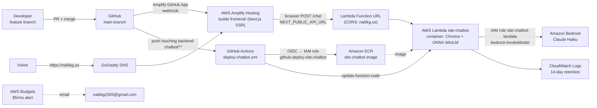

# Hosting naitikg.us on AWS

How this site is hosted, every CLI command used to set it up, and how to update, roll back, or tear it down.
Started 2026-10-08 (migration from Vercel + Render). Region: **us-east-1**.

> Placeholders: `<account-id>` = 12-digit AWS account ID, `<function-url>` = the Lambda Function URL.
> Every AWS command uses `--profile personal`. Never rely on a default profile when one machine holds several AWS accounts.

---

## 1. Architecture



Same thing in plain text:

```
 feature branch ──PR──► main
                         │
          ┌──────────────┴───────────────┐
          ▼                              ▼
  Amplify Hosting                 GitHub Actions (backend-chatbot/** changed)
  builds frontend/ (Next.js)        │ OIDC → IAM role (no stored AWS keys)
          │                         ▼
          │                       docker build → ECR → lambda update-function-code
          ▼
  https://naitikg.us ──POST /chat──► Lambda Function URL ──► Lambda "site-chatbot"
  (GoDaddy DNS → Amplify)                                     │ 1. embed question (ONNX MiniLM)
                                                              │ 2. keyword + semantic search in chroma_db
                                                              │ 3. Bedrock: Claude Haiku answers from excerpts
                                                              ▼
                                                           JSON {"response": "..."}
```

### Components

| Piece | Where | Notes |
|---|---|---|
| Frontend | `frontend/` → **Amplify Hosting** | Next.js 15; build spec in `amplify.yml`; deploys on push to `main` |
| Chatbot API | `backend-chatbot/` → **Lambda** (container image) | `lambda_function.handler`; public **Function URL** with CORS |
| Vector DB | `backend-chatbot/chroma_db/` (committed) | built **locally** by `embed.py`, baked into the image |
| Embeddings | Chroma's ONNX `all-MiniLM-L6-v2` | same model at build time and query time; no PyTorch |
| LLM | **Amazon Bedrock**, Claude Haiku (`BEDROCK_MODEL_ID`) | auth = Lambda's IAM role; no API keys anywhere |
| CI/CD | `.github/workflows/deploy-chatbot.yml` | GitHub OIDC → `github-deploy-site-chatbot` role |
| DNS | GoDaddy (registrar + DNS) | records point at Amplify; Amplify issues the TLS cert |
| Guardrail | AWS Budgets `monthly-5usd` | email at $4 actual / $5 forecast |

### AWS resources

| Resource | Name |
|---|---|
| ECR repository | `site-chatbot` (lifecycle: keep last 3 images) |
| Lambda function | `site-chatbot` (image, 1536 MB, 30 s, x86_64) |
| Lambda execution role | `site-chatbot-lambda` (`AWSLambdaBasicExecutionRole` + inline `bedrock-claude-haiku`) |
| Function URL | auth `NONE`, CORS `https://naitikg.us`, `https://www.naitikg.us`, `http://localhost:3000` (+ Amplify domain) |
| Log group | `/aws/lambda/site-chatbot` (14 days) |
| OIDC provider | `token.actions.githubusercontent.com` |
| CI deploy role | `github-deploy-site-chatbot` (only `repo:naitikg2305/PersonalWebsite:ref:refs/heads/main`) |
| Amplify app | connected to `main` |
| Budget | `monthly-5usd` |

---

## 2. One-time setup (the exact commands)

### 2.1 Local AWS CLI profile
```bash
# IAM console: Users → Create user (naitik-radier-cli) → Attach policies directly → AdministratorAccess
#              → Security credentials → Create access key → "Command Line Interface (CLI)"
aws configure --profile personal                   # paste key id + secret; region us-east-1; output json
aws configure set region us-east-1 --profile personal
chmod 600 ~/.aws/credentials
aws sts get-caller-identity --profile personal     # confirm the account before creating anything

P="--profile personal --region us-east-1"
ACCT=$(aws sts get-caller-identity --profile personal --query Account --output text)
```

### 2.2 Budget alert (free)
```bash
aws budgets create-budget --profile personal --account-id "$ACCT" \
  --budget '{"BudgetName":"monthly-5usd","BudgetLimit":{"Amount":"5","Unit":"USD"},"TimeUnit":"MONTHLY","BudgetType":"COST"}' \
  --notifications-with-subscribers '[
    {"Notification":{"NotificationType":"ACTUAL","ComparisonOperator":"GREATER_THAN","Threshold":80,"ThresholdType":"PERCENTAGE"},
     "Subscribers":[{"SubscriptionType":"EMAIL","Address":"naitikg2305@gmail.com"}]},
    {"Notification":{"NotificationType":"FORECASTED","ComparisonOperator":"GREATER_THAN","Threshold":100,"ThresholdType":"PERCENTAGE"},
     "Subscribers":[{"SubscriptionType":"EMAIL","Address":"naitikg2305@gmail.com"}]}]'
```

### 2.3 Bedrock access
```bash
# Console (us-east-1) → Amazon Bedrock → banner "Submit use case details" (once per account; shared with Anthropic)
aws bedrock get-use-case-for-model-access $P                      # errors until the form is submitted
aws bedrock list-foundation-models $P --by-provider anthropic \
  --query 'modelSummaries[?contains(modelId, `haiku`)].[modelId,modelLifecycle.status]' --output table
aws bedrock list-inference-profiles $P \
  --query 'inferenceProfileSummaries[?contains(inferenceProfileId, `haiku`)].inferenceProfileId' --output table
# Newer Claude models must be called through an inference profile (us./global. prefix), not the bare model ID:
aws bedrock-runtime converse $P --model-id us.anthropic.claude-haiku-4-5-20251001-v1:0 \
  --messages '[{"role":"user","content":[{"text":"Reply with exactly: ok"}]}]' --inference-config '{"maxTokens":50}'
```

### 2.4 Build the vector DB locally
```bash
cd backend-chatbot
uv venv --python 3.12 .venv                                       # match the Lambda runtime
uv pip install --python .venv/bin/python -r requirements.txt
.venv/bin/python embed.py                                         # → "Embedded N chunks from M markdown files"
# local end-to-end test against Bedrock (explicit profile, never the shell's AWS_PROFILE):
CHATBOT_AWS_PROFILE=personal BEDROCK_MODEL_ID=us.anthropic.claude-haiku-4-5-20251001-v1:0 \
  .venv/bin/python -c "from chatbot import answer; print(answer('What is NaviGatr?'))"
```

### 2.5 ECR repository + image
```bash
aws ecr create-repository $P --repository-name site-chatbot --image-scanning-configuration scanOnPush=true
aws ecr put-lifecycle-policy $P --repository-name site-chatbot --lifecycle-policy-text \
  '{"rules":[{"rulePriority":1,"description":"keep last 3 images","selection":{"tagStatus":"any","countType":"imageCountMoreThan","countNumber":3},"action":{"type":"expire"}}]}'

REG=$ACCT.dkr.ecr.us-east-1.amazonaws.com
SHA=$(git rev-parse --short HEAD)
aws ecr get-login-password $P | podman login --username AWS --password-stdin $REG
podman build --platform linux/amd64 -t site-chatbot backend-chatbot     # or: docker build ...
podman tag localhost/site-chatbot:latest $REG/site-chatbot:$SHA
podman push --format docker $REG/site-chatbot:$SHA                       # Lambda needs Docker manifest format
```

### 2.6 Lambda execution role (Bedrock + logs only)
```bash
aws iam create-role --profile personal --role-name site-chatbot-lambda --assume-role-policy-document \
  '{"Version":"2012-10-17","Statement":[{"Effect":"Allow","Principal":{"Service":"lambda.amazonaws.com"},"Action":"sts:AssumeRole"}]}'
aws iam attach-role-policy --profile personal --role-name site-chatbot-lambda \
  --policy-arn arn:aws:iam::aws:policy/service-role/AWSLambdaBasicExecutionRole
aws iam put-role-policy --profile personal --role-name site-chatbot-lambda --policy-name bedrock-claude-haiku --policy-document "{
  \"Version\":\"2012-10-17\",
  \"Statement\":[{\"Effect\":\"Allow\",
    \"Action\":[\"bedrock:InvokeModel\",\"bedrock:InvokeModelWithResponseStream\"],
    \"Resource\":[\"arn:aws:bedrock:*::foundation-model/anthropic.claude-haiku-*\",
                  \"arn:aws:bedrock:*:${ACCT}:inference-profile/us.anthropic.claude-haiku-*\",
                  \"arn:aws:bedrock:*:${ACCT}:inference-profile/global.anthropic.claude-haiku-*\"]}]}"
```

### 2.7 Lambda function + logs
```bash
sleep 10   # new IAM roles take a few seconds to become assumable
aws lambda create-function $P --function-name site-chatbot --package-type Image \
  --code ImageUri=$REG/site-chatbot:$SHA --role arn:aws:iam::$ACCT:role/site-chatbot-lambda \
  --memory-size 1536 --timeout 30 --architectures x86_64 \
  --environment 'Variables={BEDROCK_MODEL_ID=us.anthropic.claude-haiku-4-5-20251001-v1:0,BEDROCK_REGION=us-east-1,TOP_K=6}'
aws lambda wait function-active-v2 $P --function-name site-chatbot
aws logs create-log-group $P --log-group-name /aws/lambda/site-chatbot
aws logs put-retention-policy $P --log-group-name /aws/lambda/site-chatbot --retention-in-days 14

# smoke test (direct invoke, simulating a Function URL event)
aws lambda invoke $P --function-name site-chatbot --cli-binary-format raw-in-base64-out \
  --payload '{"body":"{\"query\":\"What is NaviGatr?\"}"}' --log-type Tail /tmp/out.json && cat /tmp/out.json
```

### 2.8 Public Function URL (CORS)
```bash
aws lambda create-function-url-config $P --function-name site-chatbot --auth-type NONE \
  --cors '{"AllowOrigins":["https://naitikg.us","https://www.naitikg.us","http://localhost:3000"],"AllowMethods":["POST"],"AllowHeaders":["content-type"],"MaxAge":3600}'
# Public URLs need BOTH permissions:
aws lambda add-permission $P --function-name site-chatbot --statement-id public-url \
  --action lambda:InvokeFunctionUrl --principal '*' --function-url-auth-type NONE
aws lambda add-permission $P --function-name site-chatbot --statement-id public-url-invoke \
  --action lambda:InvokeFunction --principal '*' --invoked-via-function-url

URL=$(aws lambda get-function-url-config $P --function-name site-chatbot --query FunctionUrl --output text)
curl -X POST "${URL}chat" -H 'content-type: application/json' -H 'Origin: https://naitikg.us' \
  -d '{"query":"What projects has Naitik built?"}' -i
```

### 2.9 CI: GitHub OIDC + deploy role
```bash
aws iam create-open-id-connect-provider --profile personal \
  --url https://token.actions.githubusercontent.com --client-id-list sts.amazonaws.com

aws iam create-role --profile personal --role-name github-deploy-site-chatbot --assume-role-policy-document "{
 \"Version\":\"2012-10-17\",
 \"Statement\":[{\"Effect\":\"Allow\",
   \"Principal\":{\"Federated\":\"arn:aws:iam::${ACCT}:oidc-provider/token.actions.githubusercontent.com\"},
   \"Action\":\"sts:AssumeRoleWithWebIdentity\",
   \"Condition\":{\"StringEquals\":{
     \"token.actions.githubusercontent.com:aud\":\"sts.amazonaws.com\",
     \"token.actions.githubusercontent.com:sub\":\"repo:naitikg2305/PersonalWebsite:ref:refs/heads/main\"}}}]}"

aws iam put-role-policy --profile personal --role-name github-deploy-site-chatbot --policy-name deploy-site-chatbot --policy-document "{
 \"Version\":\"2012-10-17\",
 \"Statement\":[
  {\"Effect\":\"Allow\",\"Action\":\"ecr:GetAuthorizationToken\",\"Resource\":\"*\"},
  {\"Effect\":\"Allow\",\"Action\":[\"ecr:BatchCheckLayerAvailability\",\"ecr:InitiateLayerUpload\",\"ecr:UploadLayerPart\",
     \"ecr:CompleteLayerUpload\",\"ecr:PutImage\",\"ecr:BatchGetImage\",\"ecr:GetDownloadUrlForLayer\"],
   \"Resource\":\"arn:aws:ecr:us-east-1:${ACCT}:repository/site-chatbot\"},
  {\"Effect\":\"Allow\",\"Action\":[\"lambda:UpdateFunctionCode\",\"lambda:GetFunction\",\"lambda:GetFunctionConfiguration\"],
   \"Resource\":\"arn:aws:lambda:us-east-1:${ACCT}:function:site-chatbot\"}]}"

# The workflow reads the role ARN from a repo variable (keeps the account ID out of the public repo):
gh variable set AWS_DEPLOY_ROLE_ARN --repo naitikg2305/PersonalWebsite \
  --body "arn:aws:iam::${ACCT}:role/github-deploy-site-chatbot"
```

### 2.10 Amplify Hosting (frontend)
```
Console → AWS Amplify → Create new app → GitHub → authorize the Amplify GitHub App
  → repo naitikg2305/PersonalWebsite, branch main
  → "My app is a monorepo" → root directory: frontend   (amplify.yml in the repo root defines the build)
  → Environment variables: NEXT_PUBLIC_API_URL = <function-url without trailing slash>
  → Save and deploy
```
Then allow the Amplify domain in the Lambda CORS config:
```bash
aws lambda update-function-url-config $P --function-name site-chatbot \
  --cors '{"AllowOrigins":["https://naitikg.us","https://www.naitikg.us","https://main.<app-id>.amplifyapp.com","http://localhost:3000"],"AllowMethods":["POST"],"AllowHeaders":["content-type"],"MaxAge":3600}'
```

### 2.11 Custom domain (GoDaddy → Amplify)
```
Amplify → App → Hosting → Custom domains → Add domain → naitikg.us (+ www)
  → Amplify shows: 1 CNAME for certificate validation + records for apex/www
GoDaddy → My Products → naitikg.us → DNS:
  - add the validation CNAME and the www CNAME exactly as shown
  - apex @: point at Amplify as instructed (GoDaddy has no ALIAS for apex; use the record Amplify gives,
    or forward apex → www)
  - DELETE the parked A records (15.197.148.33, 3.33.130.190) and the old Vercel records
```
```bash
curl -s "https://dns.google/resolve?name=naitikg.us&type=A"
curl -s "https://dns.google/resolve?name=www.naitikg.us&type=CNAME"
curl -sI https://www.naitikg.us | head -5
```

---

## 3. Day-to-day workflow

```bash
git switch -c feature/<thing>          # never commit straight to main
# ...edit...
# if site content (markdown) changed, rebuild the chatbot's vector DB:
cd backend-chatbot && .venv/bin/python embed.py && cd ..
find frontend/public/content -name '*.md' -newer backend-chatbot/chroma_db/chroma.sqlite3   # empty = DB current
git add -A && git commit -m "..."
git push -u origin feature/<thing>
gh pr create --fill --base main        # review, then merge
# merge to main → Amplify rebuilds the site; Actions redeploys the Lambda if backend-chatbot/** changed
```

Local dev:
```bash
cd backend-chatbot && CHATBOT_AWS_PROFILE=personal .venv/bin/python local_server.py     # :8000
cd frontend && NEXT_PUBLIC_API_URL=http://localhost:8000 npm run dev                      # :3000
```

Switch the model (e.g. to Haiku 5.5 once the account has access):
```bash
aws lambda update-function-configuration $P --function-name site-chatbot \
  --environment 'Variables={BEDROCK_MODEL_ID=us.anthropic.claude-haiku-5-5,BEDROCK_REGION=us-east-1,TOP_K=6}'
```

## 4. Operate

```bash
aws logs tail /aws/lambda/site-chatbot $P --since 1h --follow        # live logs
aws logs tail /aws/lambda/site-chatbot $P --since 1d | grep -E "REPORT|error"   # durations / errors
aws lambda get-function $P --function-name site-chatbot --query 'Code.ImageUri'   # what's deployed
aws ecr describe-images $P --repository-name site-chatbot --query 'imageDetails[].[imageTags[0],imagePushedAt]' --output table
aws budgets describe-budgets --profile personal --account-id "$ACCT" --query 'Budgets[].[BudgetName,CalculatedSpend.ActualSpend.Amount]'
```

Rollback the chatbot to an earlier image:
```bash
aws lambda update-function-code $P --function-name site-chatbot --image-uri $REG/site-chatbot:<older-tag>
```
Rollback the site: Amplify console → the branch → pick an earlier build → **Redeploy this version**, or revert the commit on main.

## 5. Cost (estimate)

| Item | ~Monthly |
|---|---|
| Amplify (build + hosting) | $0–1 |
| Lambda | $0 (free tier) |
| ECR storage (~0.5 GB, 3 images max) | ~$0.05–0.15 |
| CloudWatch Logs | ~$0 |
| Bedrock Claude Haiku | ~$0.0005 (5.5) – $0.0045 (4.5) per chat |

## 6. Performance notes

- Warm request: ~1.2–1.6 s (mostly the Bedrock call).
- Cold start: ~10 s normally; the very first start after deploying a new image was ~26 s (Lambda streams the 1.2 GB image lazily).
- Ideas if cold starts matter: an EventBridge keep-warm ping, more memory (= more CPU), or a slimmer image.

## 7. Gotchas hit while setting this up

- **`AWS_PROFILE` on the dev machine pointed at a work account.** Always pass `--profile personal`; the local server forces `CHATBOT_AWS_PROFILE`.
- **New account → "Your account is currently being verified"** on Bedrock for up to ~2 h.
- **Anthropic use-case form** is required once per account before any Claude call (`InvokeModel` → 404 "Model use case details have not been submitted").
- **Newer Claude models need an inference profile ID** (`us.anthropic...`), not the bare model ID.
- **`output_config.effort` is 5.x-only**: Haiku 4.5 → 400 "does not support the effort parameter".
- **Pushed a stale local image** built before a fix. Build from the commit (CI does this), and check the code inside the image.
- **Chroma needs a writable dir**: `/var/task` is read-only in Lambda, so the DB is copied to `/tmp` on cold start.
- **Small embedders blur rare proper nouns** ("Minfy" matched NaviGatr chunks), fixed with a keyword pass (`where_document={"$contains": ...}`).

## 8. Teardown

```bash
aws lambda delete-function-url-config $P --function-name site-chatbot
aws lambda delete-function $P --function-name site-chatbot
aws logs delete-log-group $P --log-group-name /aws/lambda/site-chatbot
aws ecr delete-repository $P --repository-name site-chatbot --force
aws iam delete-role-policy --profile personal --role-name site-chatbot-lambda --policy-name bedrock-claude-haiku
aws iam detach-role-policy --profile personal --role-name site-chatbot-lambda --policy-arn arn:aws:iam::aws:policy/service-role/AWSLambdaBasicExecutionRole
aws iam delete-role --profile personal --role-name site-chatbot-lambda
aws iam delete-role-policy --profile personal --role-name github-deploy-site-chatbot --policy-name deploy-site-chatbot
aws iam delete-role --profile personal --role-name github-deploy-site-chatbot
aws iam delete-open-id-connect-provider --profile personal --open-id-connect-provider-arn arn:aws:iam::$ACCT:oidc-provider/token.actions.githubusercontent.com
aws amplify delete-app $P --app-id <app-id>
aws budgets delete-budget --profile personal --account-id "$ACCT" --budget-name monthly-5usd
```
