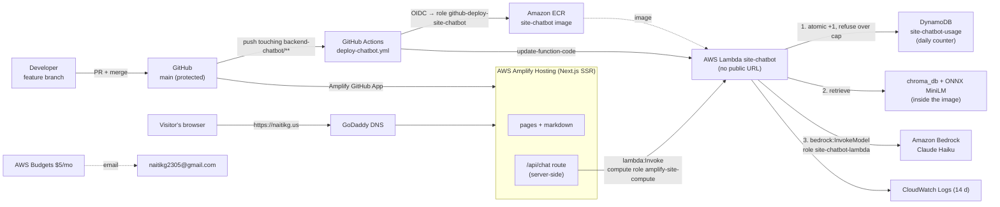

# Hosting naitikg.us on AWS

How this site is hosted, every CLI command used to set it up, and how to update, roll back, or tear it down.
Started 2026-10-08 (migration from Vercel + Render). Region: **us-east-1**.

> Placeholders: `<account-id>` = 12-digit AWS account ID, `<app-id>` = Amplify app ID.
> Every AWS command uses `--profile personal`. Never rely on a default profile when one machine holds several AWS accounts.

---

## 1. Architecture



Plain text:

```
 feature branch ──PR──► main (protected)
                          │
          ┌───────────────┴────────────────┐
          ▼                                ▼
  Amplify Hosting                   GitHub Actions (backend-chatbot/** changed)
  builds frontend/ (Next.js SSR)      │ OIDC → IAM role (no stored keys)
          │                           ▼
          │                         docker build → ECR → lambda update-function-code
          ▼
  Browser ──► https://naitikg.us/api/chat  (same origin; nothing about AWS in the browser)
                 │ Next.js route on Amplify, IAM compute role: may invoke ONLY site-chatbot
                 ▼
              Lambda "site-chatbot"  (no Function URL: not reachable from the internet)
                 │ 1. DynamoDB: today's count +1, refuse if ≥ DAILY_CAP  → hard spend ceiling
                 │ 2. embed question (ONNX MiniLM), keyword + semantic search in chroma_db
                 │ 3. Bedrock: Claude Haiku answers from the excerpts (IAM role, no API key)
                 ▼
              {"response": "..."}
```

### Components

| Piece | Where | Notes |
|---|---|---|
| Frontend | `frontend/` → **Amplify Hosting** | Next.js 15 SSR; build spec `amplify.yml`; deploys on push to `main` |
| Chat proxy | `frontend/src/app/api/chat/route.ts` | server-side; invokes the Lambda via AWS SDK with the Amplify **compute role** |
| Chatbot | `backend-chatbot/` → **Lambda** (container image) | `lambda_function.handler`; **no Function URL** |
| Spend cap | **DynamoDB** `site-chatbot-usage` | atomic per-day counter; over `DAILY_CAP` (300) → busy message, no Bedrock call |
| Vector DB | `backend-chatbot/chroma_db/` (committed) | built **locally** by `embed.py`, baked into the image |
| Embeddings | Chroma's ONNX `all-MiniLM-L6-v2` | same model at build and query time; no PyTorch |
| LLM | **Bedrock** Claude Haiku (`BEDROCK_MODEL_ID`) | auth = Lambda execution role |
| CI/CD | `.github/workflows/deploy-chatbot.yml` | GitHub OIDC → `github-deploy-site-chatbot` |
| DNS | GoDaddy | records point at Amplify; Amplify issues the TLS cert |
| Guardrail | AWS Budgets `monthly-5usd` | email at $4 actual / $5 forecast (billing data lags hours, so it isn't a brake) |

### AWS resources

| Resource | Name | Permissions |
|---|---|---|
| ECR repository | `site-chatbot` | lifecycle: keep last 3 images |
| Lambda | `site-chatbot` (image, 1536 MB, 30 s) | runs as `site-chatbot-lambda` |
| Lambda execution role | `site-chatbot-lambda` | Basic logs + `bedrock:InvokeModel` (Haiku only) + `dynamodb:UpdateItem` (usage table only) |
| DynamoDB table | `site-chatbot-usage` (on-demand, TTL `expires_at`) | |
| Amplify compute role | `amplify-site-compute` | `lambda:InvokeFunction` on `site-chatbot` only |
| CI deploy role | `github-deploy-site-chatbot` | ECR push to `site-chatbot` + `UpdateFunctionCode` on `site-chatbot`; trusted only for `repo:naitikg2305/PersonalWebsite:ref:refs/heads/main` |
| OIDC provider | `token.actions.githubusercontent.com` | |
| Log group | `/aws/lambda/site-chatbot` (14 days) | |
| Amplify app | connected to `main` | compute role `amplify-site-compute` |
| Budget | `monthly-5usd` | |

---

## 2. One-time setup (the exact commands)

### 2.1 Local AWS CLI profile
```bash
# IAM console: Users → Create user (naitik-radier-cli) → Attach policies directly → AdministratorAccess
#              → Security credentials → Create access key → "Command Line Interface (CLI)"
aws configure --profile personal                   # key id + secret; region us-east-1; output json
aws configure set region us-east-1 --profile personal
chmod 600 ~/.aws/credentials
aws sts get-caller-identity --profile personal     # confirm the account before creating anything

P="--profile personal --region us-east-1"
ACCT=$(aws sts get-caller-identity --profile personal --query Account --output text)
```

### 2.2 Budget alert (free)
```bash
aws budgets create-budget --profile personal --account-id "$ACCT" \
  --budget '{"BudgetName":"monthly-5usd","BudgetLimit":{"Amount":"5","Unit":"USD"},"TimeUnit":"MONTHLY","BudgetType":"COST"}' \
  --notifications-with-subscribers '[
    {"Notification":{"NotificationType":"ACTUAL","ComparisonOperator":"GREATER_THAN","Threshold":80,"ThresholdType":"PERCENTAGE"},
     "Subscribers":[{"SubscriptionType":"EMAIL","Address":"naitikg2305@gmail.com"}]},
    {"Notification":{"NotificationType":"FORECASTED","ComparisonOperator":"GREATER_THAN","Threshold":100,"ThresholdType":"PERCENTAGE"},
     "Subscribers":[{"SubscriptionType":"EMAIL","Address":"naitikg2305@gmail.com"}]}]'
```

### 2.3 Bedrock access
```bash
# Console (us-east-1) → Amazon Bedrock → banner "Submit use case details" (once per account; shared with Anthropic)
aws bedrock get-use-case-for-model-access $P                      # errors until the form is submitted
aws bedrock list-foundation-models $P --by-provider anthropic \
  --query 'modelSummaries[?contains(modelId, `haiku`)].[modelId,modelLifecycle.status]' --output table
aws bedrock list-inference-profiles $P \
  --query 'inferenceProfileSummaries[?contains(inferenceProfileId, `haiku`)].inferenceProfileId' --output table
# Newer Claude models must be called through an inference profile (us./global. prefix), not the bare model ID:
aws bedrock-runtime converse $P --model-id us.anthropic.claude-haiku-4-5-20251001-v1:0 \
  --messages '[{"role":"user","content":[{"text":"Reply with exactly: ok"}]}]' --inference-config '{"maxTokens":50}'
```

### 2.4 Build the vector DB locally
```bash
cd backend-chatbot
uv venv --python 3.12 .venv                                       # match the Lambda runtime
uv pip install --python .venv/bin/python -r requirements.txt
.venv/bin/python embed.py                                         # → "Embedded N chunks from M markdown files"
CHATBOT_AWS_PROFILE=personal BEDROCK_MODEL_ID=us.anthropic.claude-haiku-4-5-20251001-v1:0 \
  .venv/bin/python -c "from chatbot import answer; print(answer('What is NaviGatr?'))"
```

### 2.5 ECR repository + image
```bash
aws ecr create-repository $P --repository-name site-chatbot --image-scanning-configuration scanOnPush=true
aws ecr put-lifecycle-policy $P --repository-name site-chatbot --lifecycle-policy-text \
  '{"rules":[{"rulePriority":1,"description":"keep last 3 images","selection":{"tagStatus":"any","countType":"imageCountMoreThan","countNumber":3},"action":{"type":"expire"}}]}'

REG=$ACCT.dkr.ecr.us-east-1.amazonaws.com
SHA=$(git rev-parse --short HEAD)                                        # commit first, so the tag = the code
aws ecr get-login-password $P | podman login --username AWS --password-stdin $REG
podman build --platform linux/amd64 -t site-chatbot backend-chatbot
podman tag localhost/site-chatbot:latest $REG/site-chatbot:$SHA
podman push --format docker $REG/site-chatbot:$SHA                       # Lambda needs Docker manifest format
```

### 2.6 DynamoDB daily-cap table
```bash
aws dynamodb create-table $P --table-name site-chatbot-usage \
  --attribute-definitions AttributeName=day,AttributeType=S --key-schema AttributeName=day,KeyType=HASH \
  --billing-mode PAY_PER_REQUEST
aws dynamodb wait table-exists $P --table-name site-chatbot-usage
aws dynamodb update-time-to-live $P --table-name site-chatbot-usage \
  --time-to-live-specification Enabled=true,AttributeName=expires_at
```

### 2.7 Lambda execution role (Bedrock + logs + counter)
```bash
aws iam create-role --profile personal --role-name site-chatbot-lambda --assume-role-policy-document \
  '{"Version":"2012-10-17","Statement":[{"Effect":"Allow","Principal":{"Service":"lambda.amazonaws.com"},"Action":"sts:AssumeRole"}]}'
aws iam attach-role-policy --profile personal --role-name site-chatbot-lambda \
  --policy-arn arn:aws:iam::aws:policy/service-role/AWSLambdaBasicExecutionRole
aws iam put-role-policy --profile personal --role-name site-chatbot-lambda --policy-name bedrock-claude-haiku --policy-document "{
  \"Version\":\"2012-10-17\",
  \"Statement\":[{\"Effect\":\"Allow\",
    \"Action\":[\"bedrock:InvokeModel\",\"bedrock:InvokeModelWithResponseStream\"],
    \"Resource\":[\"arn:aws:bedrock:*::foundation-model/anthropic.claude-haiku-*\",
                  \"arn:aws:bedrock:*:${ACCT}:inference-profile/us.anthropic.claude-haiku-*\",
                  \"arn:aws:bedrock:*:${ACCT}:inference-profile/global.anthropic.claude-haiku-*\"]}]}"
aws iam put-role-policy --profile personal --role-name site-chatbot-lambda --policy-name daily-usage-counter --policy-document \
  "{\"Version\":\"2012-10-17\",\"Statement\":[{\"Effect\":\"Allow\",\"Action\":\"dynamodb:UpdateItem\",\"Resource\":\"arn:aws:dynamodb:us-east-1:${ACCT}:table/site-chatbot-usage\"}]}"
```

### 2.8 Lambda function + logs (no public URL)
```bash
sleep 10   # new IAM roles take a few seconds to become assumable
aws lambda create-function $P --function-name site-chatbot --package-type Image \
  --code ImageUri=$REG/site-chatbot:$SHA --role arn:aws:iam::$ACCT:role/site-chatbot-lambda \
  --memory-size 1536 --timeout 120 --architectures x86_64 \
  --environment 'Variables={BEDROCK_MODEL_ID=us.anthropic.claude-haiku-4-5-20251001-v1:0,BEDROCK_REGION=us-east-1,TOP_K=6,DAILY_CAP_TABLE=site-chatbot-usage,DAILY_CAP=300}'
aws lambda wait function-active-v2 $P --function-name site-chatbot
aws logs create-log-group $P --log-group-name /aws/lambda/site-chatbot
aws logs put-retention-policy $P --log-group-name /aws/lambda/site-chatbot --retention-in-days 14

# smoke test (direct invoke with a Function-URL-shaped event)
aws lambda invoke $P --function-name site-chatbot --cli-binary-format raw-in-base64-out \
  --payload '{"body":"{\"query\":\"What is NaviGatr?\"}"}' --log-type Tail /tmp/out.json && cat /tmp/out.json
```
History: a public Function URL (`--auth-type NONE` + CORS) was created first, then **removed** because anyone with the URL could spend Bedrock tokens (see §7). Commands used to lock it down:
```bash
aws lambda update-function-url-config $P --function-name site-chatbot --auth-type AWS_IAM
aws lambda remove-permission $P --function-name site-chatbot --statement-id public-url
aws lambda remove-permission $P --function-name site-chatbot --statement-id public-url-invoke
aws lambda delete-function-url-config $P --function-name site-chatbot
```

### 2.9 Amplify compute role (lets the site's server invoke the Lambda)
```bash
aws iam create-role --profile personal --role-name amplify-site-compute --assume-role-policy-document \
  '{"Version":"2012-10-17","Statement":[{"Effect":"Allow","Principal":{"Service":"amplify.amazonaws.com"},"Action":"sts:AssumeRole"}]}'
aws iam put-role-policy --profile personal --role-name amplify-site-compute --policy-name invoke-site-chatbot --policy-document \
  "{\"Version\":\"2012-10-17\",\"Statement\":[{\"Effect\":\"Allow\",\"Action\":\"lambda:InvokeFunction\",\"Resource\":\"arn:aws:lambda:us-east-1:${ACCT}:function:site-chatbot\"}]}"
```

### 2.10 CI: GitHub OIDC + deploy role
```bash
aws iam create-open-id-connect-provider --profile personal \
  --url https://token.actions.githubusercontent.com --client-id-list sts.amazonaws.com

aws iam create-role --profile personal --role-name github-deploy-site-chatbot --assume-role-policy-document "{
 \"Version\":\"2012-10-17\",
 \"Statement\":[{\"Effect\":\"Allow\",
   \"Principal\":{\"Federated\":\"arn:aws:iam::${ACCT}:oidc-provider/token.actions.githubusercontent.com\"},
   \"Action\":\"sts:AssumeRoleWithWebIdentity\",
   \"Condition\":{\"StringEquals\":{
     \"token.actions.githubusercontent.com:aud\":\"sts.amazonaws.com\",
     \"token.actions.githubusercontent.com:sub\":\"repo:naitikg2305/PersonalWebsite:ref:refs/heads/main\"}}}]}"

aws iam put-role-policy --profile personal --role-name github-deploy-site-chatbot --policy-name deploy-site-chatbot --policy-document "{
 \"Version\":\"2012-10-17\",
 \"Statement\":[
  {\"Effect\":\"Allow\",\"Action\":\"ecr:GetAuthorizationToken\",\"Resource\":\"*\"},
  {\"Effect\":\"Allow\",\"Action\":[\"ecr:BatchCheckLayerAvailability\",\"ecr:InitiateLayerUpload\",\"ecr:UploadLayerPart\",
     \"ecr:CompleteLayerUpload\",\"ecr:PutImage\",\"ecr:BatchGetImage\",\"ecr:GetDownloadUrlForLayer\"],
   \"Resource\":\"arn:aws:ecr:us-east-1:${ACCT}:repository/site-chatbot\"},
  {\"Effect\":\"Allow\",\"Action\":[\"lambda:UpdateFunctionCode\",\"lambda:GetFunction\",\"lambda:GetFunctionConfiguration\"],
   \"Resource\":\"arn:aws:lambda:us-east-1:${ACCT}:function:site-chatbot\"}]}"

# gh must be logged in as the repo owner (git push uses SSH keys; gh uses its own API token)
gh auth switch -u naitikg2305
gh variable set AWS_DEPLOY_ROLE_ARN --repo naitikg2305/PersonalWebsite \
  --body "arn:aws:iam::${ACCT}:role/github-deploy-site-chatbot"     # keeps the account ID out of the public repo
```

### 2.11 Git flow: protect main
```bash
gh api -X PUT repos/naitikg2305/PersonalWebsite/branches/main/protection --input - <<'EOF'
{"required_status_checks":null,"enforce_admins":false,"required_pull_request_reviews":{"required_approving_review_count":0},
 "restrictions":null,"allow_force_pushes":false,"allow_deletions":false}
EOF
```

### 2.12 Amplify Hosting (frontend)
```
Console → AWS Amplify → Create new app → GitHub → authorize (as naitikg2305)
  → repo PersonalWebsite, branch (test with the feature branch first, then main)
  → "My app is a monorepo" → root directory: frontend      (amplify.yml in the repo root defines the build)
  → Save and deploy
```
Attach the compute role so `/api/chat` can invoke the Lambda:
```bash
aws amplify update-app $P --app-id <app-id> --compute-role-arn arn:aws:iam::$ACCT:role/amplify-site-compute
# (or console: App settings → IAM roles → Compute role → amplify-site-compute), then redeploy the branch
```
No environment variables are needed: the browser calls same-origin `/api/chat`, and the route defaults to function `site-chatbot` in us-east-1.

### 2.13 Custom domain (GoDaddy → Amplify), done 2026-10-08
```bash
# Amplify: main = production, feature branch = development
aws amplify create-branch $P --app-id <app-id> --branch-name main --stage PRODUCTION --framework "Next.js - SSR" --enable-auto-build
aws amplify start-job $P --app-id <app-id> --branch-name main --job-type RELEASE
# domain: apex + www → main, Amplify-managed certificate
aws amplify create-domain-association $P --app-id <app-id> --domain-name naitikg.us \
  --sub-domain-settings prefix=www,branchName=main prefix=,branchName=main --certificate-settings type=AMPLIFY_MANAGED
aws amplify get-domain-association $P --app-id <app-id> --domain-name naitikg.us \
  --query 'domainAssociation.{status:domainStatus,cert:certificateVerificationDNSRecord,subs:subDomains[].dnsRecord}'
```
GoDaddy → My Products → naitikg.us → **DNS**:

| Action | Type | Name | Value |
|---|---|---|---|
| **edit** (was `cname.vercel-dns.com`) | CNAME | `www` | `<id>.cloudfront.net` (from Amplify) |
| **add** | CNAME | `_<hash>` | `_<hash>.<x>.acm-validations.aws` (cert validation, from Amplify) |
| **keep** | NS ×2, SOA | `@` | GoDaddy-managed, locked |
| **keep** | TXT | `_dmarc` | email anti-spoofing; exactly **one** DMARC record (duplicates invalidate both) |

**Bare domain:** GoDaddy can't CNAME/ALIAS the apex, so use **Forwarding**: `naitikg.us` → `https://www.naitikg.us`, Permanent (301), Forward only. GoDaddy then adds two locked A `@` records (its forwarding servers). Make sure the destination includes `www.` (my first attempt redirected to itself).

Verify:
```bash
curl -s "https://dns.google/resolve?name=www.naitikg.us&type=CNAME"     # → <id>.cloudfront.net
aws amplify get-domain-association $P --app-id <app-id> --domain-name naitikg.us --query 'domainAssociation.domainStatus'
#   PENDING_VERIFICATION → PENDING_DEPLOYMENT → AVAILABLE   (~15 min after DNS was right)
CF=$(getent ahosts <id>.cloudfront.net | awk 'NR==1{print $1}')
curl -s -o /dev/null -w "%{http_code}\n" --resolve www.naitikg.us:443:$CF https://www.naitikg.us/   # test before caches expire
curl -s -i http://naitikg.us | grep -i location                         # → www
resolvectl flush-caches                                                   # local machine stuck on the old answer
```
Expect up to **1 hour** of mixed results: the old record's TTL was 1 hour, so some resolvers keep serving the Vercel address. Lower TTLs a day *before* a cutover to avoid this.

---

## 3. Day-to-day workflow

```bash
git switch -c feature/<thing>          # main is protected: changes go through PRs
# ...edit...
# if site content (markdown) changed, rebuild the chatbot's vector DB:
cd backend-chatbot && .venv/bin/python embed.py && cd ..
find frontend/public/content -name '*.md' -newer backend-chatbot/chroma_db/chroma.sqlite3   # empty = DB current
git add -A && git commit -m "..."
git push -u origin feature/<thing>
gh pr create --fill --base main        # review, then merge
# merge → Amplify rebuilds the site; Actions redeploys the Lambda if backend-chatbot/** changed
```

Local dev (the real Lambda, via your personal profile):
```bash
cd frontend && CHATBOT_AWS_PROFILE=personal npm run dev        # http://localhost:3000, chat → /api/chat → Lambda
```
Backend only, no Lambda (calls Bedrock directly from your machine):
```bash
cd backend-chatbot && CHATBOT_AWS_PROFILE=personal .venv/bin/python local_server.py     # :8000
```

Switch model or cap:
```bash
aws lambda update-function-configuration $P --function-name site-chatbot --environment \
  'Variables={BEDROCK_MODEL_ID=us.anthropic.claude-haiku-5-5,BEDROCK_REGION=us-east-1,TOP_K=6,DAILY_CAP_TABLE=site-chatbot-usage,DAILY_CAP=300}'
```

## 4. Operate

```bash
aws logs tail /aws/lambda/site-chatbot $P --since 1h --follow                    # live logs
aws logs tail /aws/lambda/site-chatbot $P --since 1d | grep -E "REPORT|error"    # durations / errors
aws dynamodb get-item $P --table-name site-chatbot-usage \
  --key "{\"day\":{\"S\":\"$(date -u +%F)\"}}" --query 'Item.count.N' --output text   # chats today
aws lambda get-function $P --function-name site-chatbot --query 'Code.ImageUri'   # what's deployed
aws ecr describe-images $P --repository-name site-chatbot --query 'imageDetails[].[imageTags[0],imagePushedAt]' --output table
aws budgets describe-budgets --profile personal --account-id "$ACCT" --query 'Budgets[].[BudgetName,CalculatedSpend.ActualSpend.Amount]'
```
Rollback the chatbot: `aws lambda update-function-code $P --function-name site-chatbot --image-uri $REG/site-chatbot:<older-tag>`
Rollback the site: Amplify console → branch → earlier build → **Redeploy this version**, or revert the commit on `main`.

## 5. Cost (estimate)

| Item | ~Monthly |
|---|---|
| Amplify (build + SSR hosting) | $0–1 |
| Lambda | $0 (free tier) |
| DynamoDB (one tiny item/day) | $0 |
| ECR storage (~0.5 GB × ≤3 images) | ~$0.05–0.15 |
| CloudWatch Logs | ~$0 |
| Bedrock Claude Haiku | ~$0.0005 (5.5) – $0.0045 (4.5) per chat; **hard max ≈ 300 chats/day** |

## 6. Performance notes

- Warm request: ~1.2–1.6 s (mostly the Bedrock call). Over-cap refusal: ~0.1 s.
- Cold start: ~10 s normally; the first start after a new image was ~26 s (Lambda streams the 1.2 GB image lazily).
- If cold starts matter: an EventBridge keep-warm ping, more memory (= more CPU), or a slimmer image.

## 7. Security model (why it's built this way)

A public chatbot needs *some* public entry point; the goal is to control **who can reach the expensive part and how often**.
- **No public Lambda URL.** The first version had one (CORS-restricted). CORS only stops *other websites' browsers*, not `curl`. With the account's 10-way Lambda concurrency at ~1.5 s per answer, a script could do ~24k chats/hour ≈ **$100–190/hour** on Haiku 4.5, and budget emails arrive hours late.
- **Same-origin `/api/chat` proxy:** the browser never sees AWS details; only Amplify's compute role (`lambda:InvokeFunction` on one function) can reach the Lambda.
- **Hard daily cap** (DynamoDB atomic counter, checked *before* Bedrock): the worst case is bounded to ≈ 300 × $0.008 ≈ **$2.40/day** regardless of traffic.
- **Least-privilege roles** everywhere; no long-lived AWS keys in GitHub or the app.

## 8. Gotchas hit while setting this up

- **`AWS_PROFILE` on the dev machine pointed at a work account.** Always pass `--profile personal`; the app forces `CHATBOT_AWS_PROFILE` locally.
- **New account → "Your account is currently being verified"** on Bedrock for up to ~2 h.
- **Anthropic use-case form** is required once per account before any Claude call (`InvokeModel` → 404 "Model use case details have not been submitted").
- **Newer Claude models need an inference profile ID** (`us.anthropic...`), not the bare model ID.
- **`output_config.effort` is 5.x-only**: Haiku 4.5 → 400 "does not support the effort parameter" (my first version check also matched `haiku-4-5`).
- **Pushed a stale local image** built before a fix. Commit first, tag with the SHA, and check the code inside the image (CI avoids this).
- **Chroma needs a writable dir**: `/var/task` is read-only in Lambda, so the DB is copied to `/tmp` on cold start.
- **Small embedders blur rare proper nouns** ("Minfy" → NaviGatr chunks), fixed with a keyword pass (`where_document={"$contains": ...}`).
- **Lambda timeout must exceed the first cold start of a new image.** With 30 s, the first start after a CI deploy (>30 s) was killed, the next request started cold again, and the live chat returned 504s. Raised to 120 s, and warm after deploys:
  `aws lambda invoke $P --function-name site-chatbot --cli-binary-format raw-in-base64-out --payload '{"body":"{\"query\":\"hi\"}"}' /tmp/o.json`
- **`git push` ≠ `gh`**: pushing uses SSH keys; `gh` (PRs, repo variables, branch protection) needs its own login, and `gh auth login --web` authorizes whichever account the browser is signed into.

## 9. Teardown

```bash
aws lambda delete-function $P --function-name site-chatbot
aws logs delete-log-group $P --log-group-name /aws/lambda/site-chatbot
aws ecr delete-repository $P --repository-name site-chatbot --force
aws dynamodb delete-table $P --table-name site-chatbot-usage
for pol in bedrock-claude-haiku daily-usage-counter; do
  aws iam delete-role-policy --profile personal --role-name site-chatbot-lambda --policy-name $pol; done
aws iam detach-role-policy --profile personal --role-name site-chatbot-lambda --policy-arn arn:aws:iam::aws:policy/service-role/AWSLambdaBasicExecutionRole
aws iam delete-role --profile personal --role-name site-chatbot-lambda
aws iam delete-role-policy --profile personal --role-name amplify-site-compute --policy-name invoke-site-chatbot
aws iam delete-role --profile personal --role-name amplify-site-compute
aws iam delete-role-policy --profile personal --role-name github-deploy-site-chatbot --policy-name deploy-site-chatbot
aws iam delete-role --profile personal --role-name github-deploy-site-chatbot
aws iam delete-open-id-connect-provider --profile personal --open-id-connect-provider-arn arn:aws:iam::$ACCT:oidc-provider/token.actions.githubusercontent.com
aws amplify delete-app $P --app-id <app-id>
aws budgets delete-budget --profile personal --account-id "$ACCT" --budget-name monthly-5usd
```
