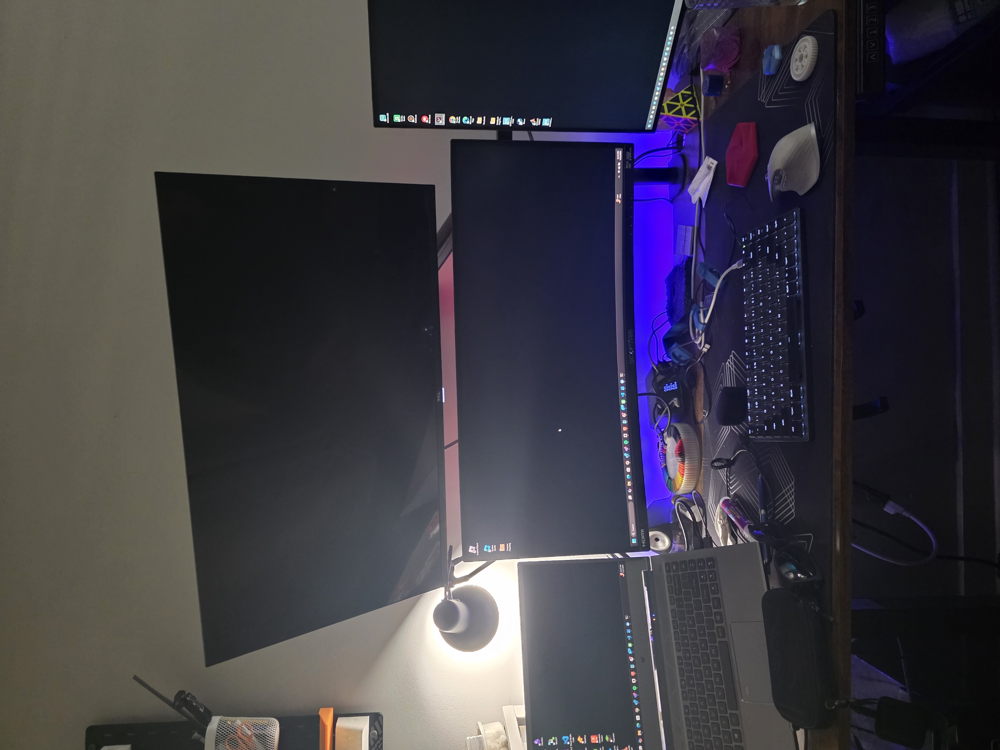
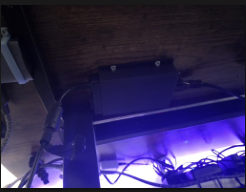
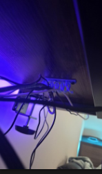
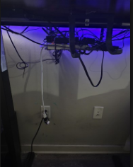
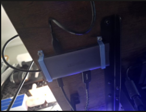
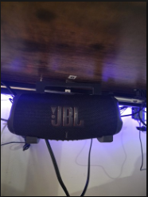

## 3D-Printed Cable Management System for Standing Desk  
I designed and printed a set of components to keep my standing desk setup clean, mobile, and wire-free. The goal was to keep all wires tucked underneath the desk, so the entire setup could move up and down smoothly without clutter.

**Components:**
- **Custom Laptop Adapter Holder**  
  Screws underneath the desk to hold the laptop charger in place, eliminating dangling cables.

  

- **Printed Wire Organizers**  
  Used pre-existing models to route and secure wires under the desk.

  

- **Custom Power Strip Holder**  
  Mounted under the desk to consolidate all power connections, allowing a single cable to route down to the wall socket.

  

- **Custom USB C Dock Holder**  
Mounted under the desk to consolidate all USB connections, allowing a single cable to route to the Computer.

-  **JBL Holder** 
  Mounted under the desk to hold my bluetooth speaker

  

This setup keeps all my devices—monitors, keyboard, laptop, lamp—connected without mess, even as the desk moves.

**STL Files:**  
- [Laptop Adapter Holder](#)  
- [Wire Organizers](#)  
- [Power Strip Holder](#)

