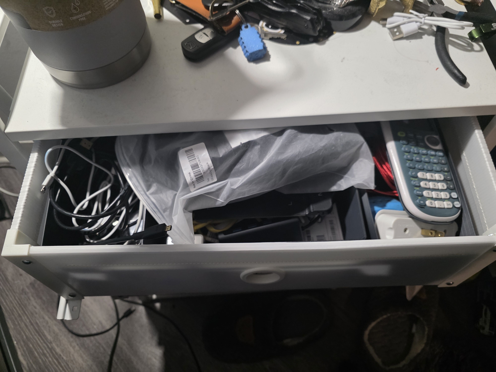
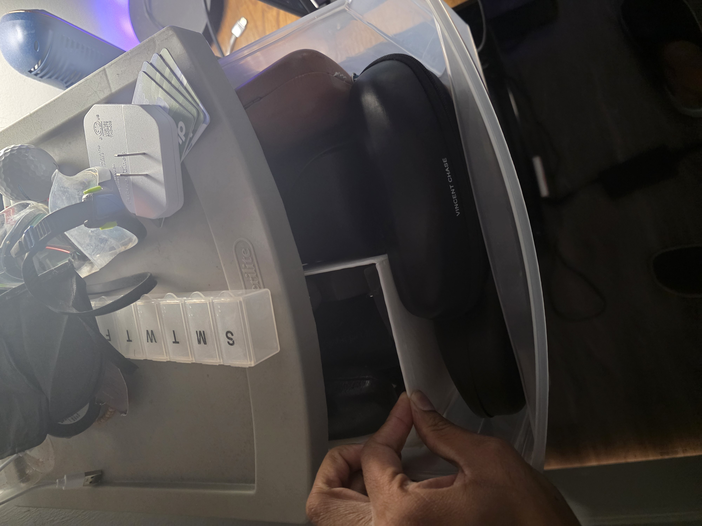

**Custom 3D-Printed Drawer Separator**  
Designed and printed custom drawer separators to maximize space efficiency in oddly sized college drawers. Market options were too short and left wasted space, so I tailored each piece to fit perfectly, helping organize my limited storage area.

