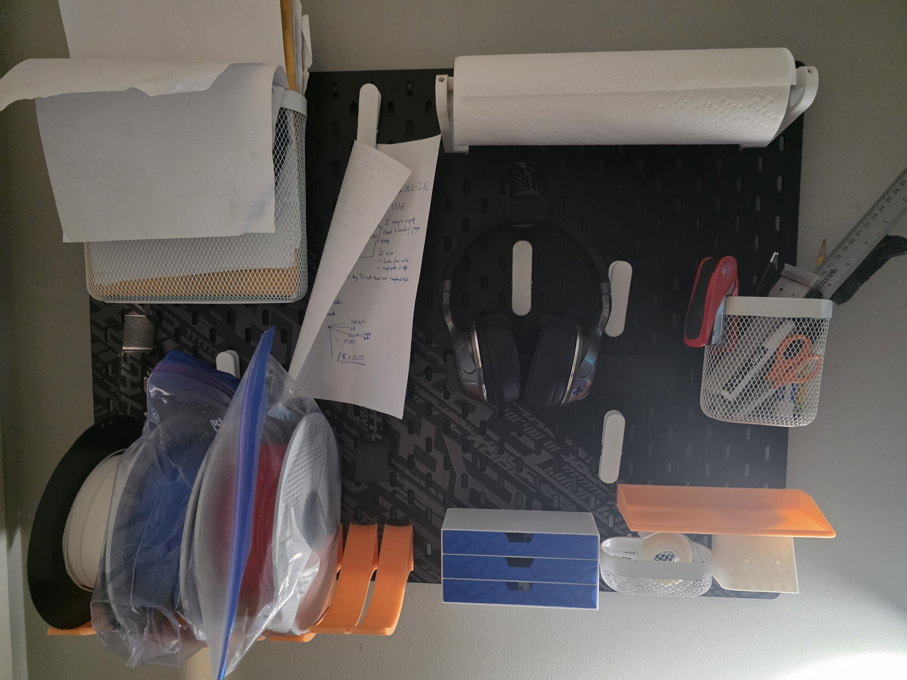

**Custom 3D-Printed Add-ons for IKEA Skådis Board**  
I wanted more functional and personalized components for my IKEA Skådis pegboard, so I designed and printed a few key add-ons to improve everyday usability.

**Printed Add-ons:**
- **Mini Drawers** – For storing small tools, USBs, and bits.
- **Wallet + Key Holder** – A single mounted unit to keep essentials organized and visible.
- **PLA Spool Holder** – Keeps filament spools accessible and off my desk.

These prints made my pegboard much more useful for daily storage and organization.

**STL Files:**  
- [Mini Drawers](#)  
- [Wallet + Key Holder](#)  
- [PLA Spool Holder](#)

