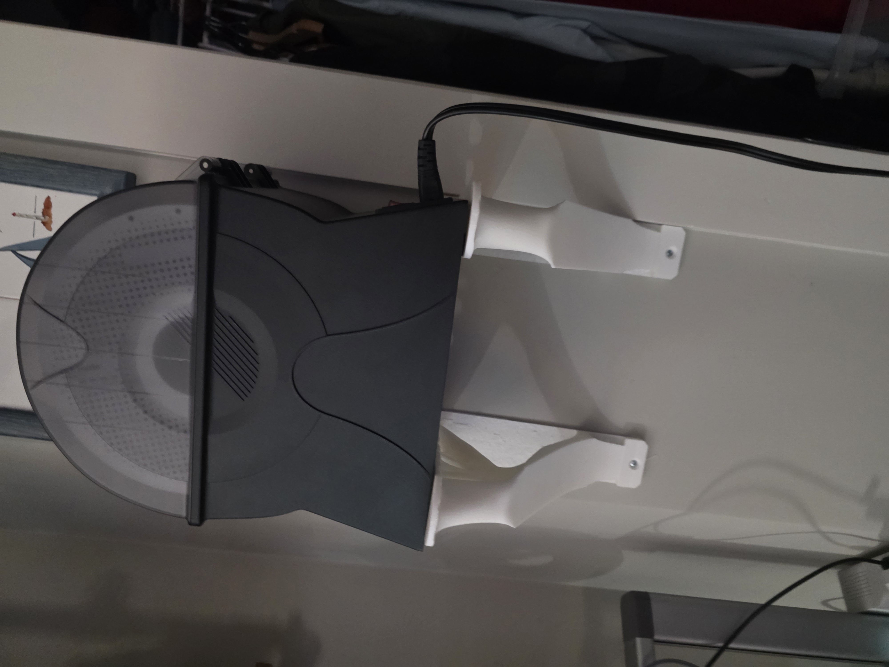

**3D-Printed Shelf for Filament Dehydrator**  
To improve the quality of my 3D prints, I needed a shelf to hold a dehydrator that keeps filament dry and clean. Instead of buying a new $40 shelf, I found a free STL file online and printed it myself. These shelves are strong enough to hold up to 80 lbs each, securely supporting the dehydrator and ensuring my filament stays moisture-free for clean, accurate prints.

**STL File:**  
- [Filament Dehydrator Shelf](#)

