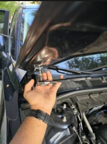
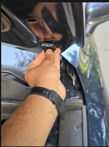
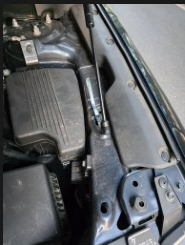

# 🚗 Installing Hydraulic Hood Struts

I installed **hydraulic hood struts** in my car to make working under the hood easier — and let’s be honest, it just looks cooler. Instead of relying on the basic manual hood prop rod, I wanted a smooth, automatic hood-lifting experience.

---

## 🛠️ Step-by-Step Instructions

### 1. Upper Bracket Installation (Hood Side)
- The hood connects to the chassis with **four bolts** on each side.  
- Remove the **top bolt** on each side.  
- Install the **upper bracket** for the hood struts in its place.  
- Reinsert the bolt through the bracket and torque it to **12 ft-lbs**.

 

### 2. Lower Bracket Installation (Fender Side)
- On the fender, there are **pre-existing holes** — but they’re **too large** to hold the standoffs securely.  
- Use the **supplied thin metal brackets** designed to slide under the fender.  
- These provide a proper mounting surface for the **bottom standoffs**.  
- Secure the lower mounting points by screwing into these inner support brackets.

### 3. Install the Struts
- With the brackets securely mounted at both ends, **snap the struts** into the top and bottom ball studs.  
- Do this for **both sides** of the hood.

✅ Now, when I open my hood, it lifts itself up and stays up — hands-free, clean, and way more convenient when working on the engine.

---

*Photos and bracket kit part number will be added later.*
