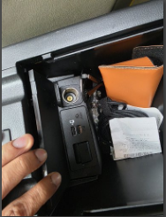

# 📱 Retrofitting Android Auto into a 2017 Car (Flush OEM Look)

Because my 2017 car didn’t come with Android Auto, and I didn’t want an aftermarket or protruding screen, I decided to retrofit a factory-style Android Auto experience by internally replacing the USB hub and installing new firmware. This involved a deep interior disassembly and careful wire routing. Here's how I did it:

---

## 🛠️ Step-by-Step Instructions

### 1. Remove Center Console USB Hub
- Open the center armrest storage compartment.  
- Remove the USB hub located inside.  
- Disconnect all attached wiring.

 

### 2. Disassemble Trim Around Gear Selector
- Remove the plastic trim pieces on the **left and right sides** of the gear selector.  
- Remove the **stereo control unit** above the gear selector (disconnect attached cables).  
- Remove the **housing around the automatic gear shift knob** to make room for routing wires.  
- Disconnect and remove the **center 12V socket**.

  

### 3. Disassemble Dashboard Trim
- Remove the two main interior dashboard trim pieces:  
  - **Left side**: Disconnect the **start/stop switch**.  
  - **Right side**: Disconnect the **hazard switch**.

    

### 4. Drop the Glove Compartment
- Squeeze both sides of the glove box inward until it drops down, revealing the area behind it.

### 5. Remove Infotainment System
- Unscrew the **two nuts** and **two screws** holding in the infotainment screen.  
- Slide out the unit to access the wiring harness behind it.

### 6. Replace Wire from Hub to Infotainment System
- Disconnect the original wire connecting the center console hub to the infotainment unit.  
- Route the new wire starting from:  
  - The **back of the infotainment system**  
  - Through the **dashboard interior**, behind the glove box  
  - Down past the **12V socket area**  
  - Under the **gear selector assembly**  
  - Behind the **stereo control unit**  
  - Up to the **new USB hub** location in the center console.

    

### 7. Install New Android Auto-Compatible USB Hub
- Replace the old USB hub with the new one that supports Android Auto.  
- Plug in the freshly routed wire.

### 8. Reassemble Everything (in reverse order)
- **Infotainment unit**: Slide back in and secure with 2 nuts (torqued to **9 ft-lbs**) and 2 hand-tight screws.  
- **Hazard switch**: Reconnect and snap the trim back into place.  
- **Start/stop button**: Reconnect and snap that trim piece in.  
- **12V socket**: Reconnect and snap back in.  
- **Gear selector housing**: Snap back in.  
- **Stereo control unit**: Reconnect and snap in place.  
- **Side trims around gear selector**: Snap both sides back in.  
- **Glove box**: Push it back into its tracks until it snaps into place.  
- **Center console storage**: Reinsert and snap in.  

✅ **Done! Android Auto now works, fully internalized with OEM aesthetics.**
