# 🔧 Replacing Spark Plugs on a High-Mileage Car

I bought a used car with **150,000 miles**, and upon researching, found that spark plugs should be replaced around **75,000 miles**. That means mine were **long overdue**. The stock spark plugs are **iridium spark plugs** (I'll attach the model number later). They’re supposed to be gapped at **0.044 inches**.

---

## 🛠️ Step-by-Step Instructions

### 1. Pop the Hood and Remove Engine Cover
- Open the hood and **remove the engine cover** to expose the ignition components.  
- Set the cover aside safely.
- Ensure vacuuming leaves and dust before undoing anything to prevent debris from entering the engine

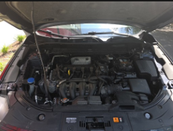 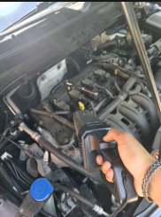

### 2. Remove Spark Plug Coils
- Locate the **four spark plug coils**.  
- Use a **10mm socket** to **undo the four bolts** holding the coils in place.  
- Carefully **pull out each coil**, which exposes the spark plugs.
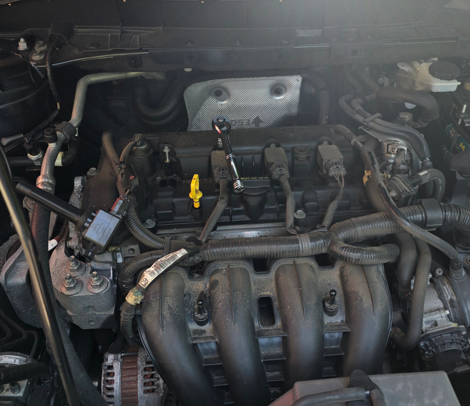

### 3. Remove Old Spark Plugs
- Use a **14mm spark plug socket** attached to a wrench.  
- Insert into each spark plug well and **unscrew the spark plugs**.  
- The spark plugs will remain seated in the socket upon removal.

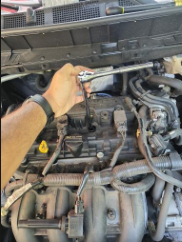 

### 4. Measure and Compare Gaps
- Use a **spark plug gap tool** to measure the old and new plugs.  
- Old spark plugs: **0.047 inches** (over spec).  
- New iridium spark plugs: **0.040 inches** (perfect range).  
- Spec calls for **0.044 inches** — within tolerance.

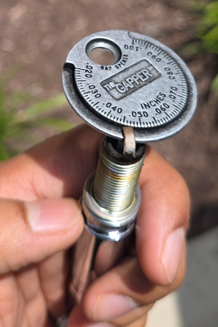 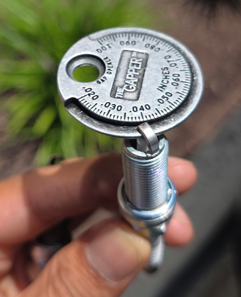 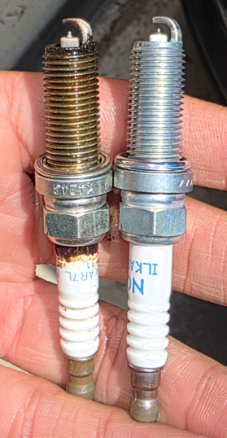

### 5. Install New Spark Plugs (Avoid Cross-Threading)
- Remove the wrench from your spark plug socket.  
- Insert the new spark plug into the socket.  
- Carefully **hand-tighten** each plug using minimal force to avoid cross-threading.  
- Once snug, use a **torque wrench** to tighten each plug to **14 ft-lbs**.

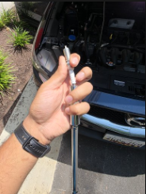 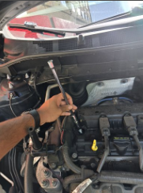 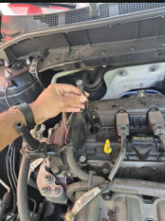 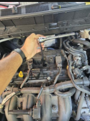

### 6. Reinstall Coils and Final Torque
- Reinsert the **spark plug coils** into their positions.  
- Use a **10mm socket** to reinstall and tighten each coil bolt to **8 ft-lbs**.

✅ **Spark plugs replaced — smoother engine response and better fuel efficiency!**

---

*Model number and photos will be added later.*
