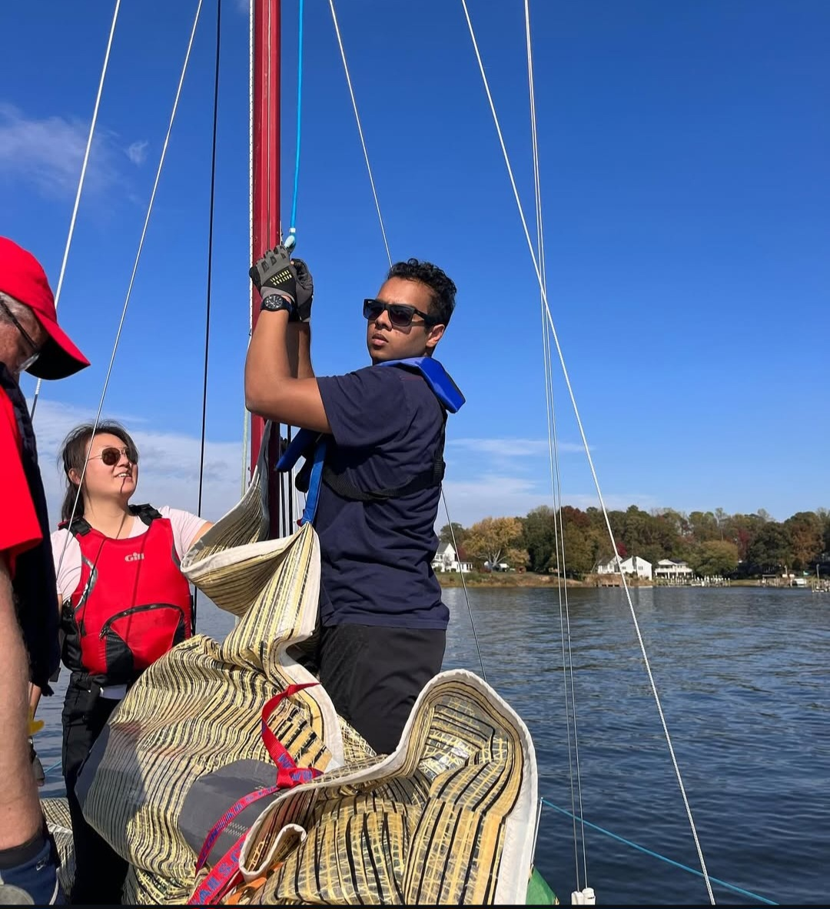

---

title: "Sailing at UMD"
category: "Interests"
slug: "sailing"

---

# ⛵ Sailing at the University of Maryland

I've had the privilege of sailing both small and large boats as part of the UMD sailing team and beyond — each offering its own unique set of skills, strategies, and adrenaline-pumping moments.

 
---

## 🌀 Points of Sail

Understanding the angle of your boat relative to the wind is foundational in sailing. Here are the main points of sail:

- **Close Hauled**: Sailing as close to the wind as possible (~45°)
- **Close Reach**: Slightly off the wind, faster than close hauled
- **Beam Reach**: Wind coming directly from the side — typically the fastest point of sail
- **Broad Reach**: Wind from behind at an angle
- **Running**: Wind directly from behind — requires more steering control

---

## 🔄 Roll Tacking (in FJs)

In Flying Juniors (FJs), roll tacking is critical for efficient maneuvering during races. It involves coordinated weight shifting between skipper and crew to:

1. Heel the boat to windward before the tack.
2. Rapidly flatten the boat post-tack to regain speed.
3. Minimize time in irons and maintain momentum.

> Timing and communication are key — every ounce of speed counts in competitive dinghy racing.

---

## ⛵ Small Boats (FJs)

- **Role**: Skipper  
- **Boats**: Flying Juniors (FJs), the standard collegiate racing dinghy  
- **Responsibility**: Helm, tactical decisions, roll tacks, starting strategies, and boat handling

I honed my skills in close-quarters racing, balancing boat speed with right-of-way tactics. FJs demand precision and synergy between skipper and crew — every maneuver is felt instantly on the water.

---

## 🚤 Big Boats & Team Racing

On larger keelboats (typically 25–40 ft), roles are more specialized:

- **Jib Trimmer** (my role): Responsible for adjusting the foresail (jib) to match wind shifts and optimize drive.
- **Skipper**: Steers the boat and makes tactical calls.
- **Spin Trimmer**: Manages the spinnaker during downwind legs — timing and smooth gybes matter.
- **Bowman**: Handles douses, sail changes, and foredeck management.
- **Pit**: Coordinates halyards and lines from the mast to the cockpit.

> I served as **Jib Trimmer** on big boats — synchronizing with the skipper, anticipating shifts, and calling gusts.

---

## 🌬️ Jib Douse, Spinnaker Sets, and More

Sailing big boats taught me more advanced maneuvers:

- **Jib Douse**: Dropping the jib efficiently before rounding a mark or deploying a spinnaker
- **Spinnaker Hoist**: Releasing the chute at the right moment to catch the wind without fouling
- **Gybe Sets**: Changing direction while deploying or trimming the spinnaker

---

