# NaviGatr 3D Printing & Headset Design Guide

This document outlines the 3D modeling process, printing considerations, component redesigns, and physical assembly strategies used to build the NaviGatr headset. The design is focused on portability, thermal stability, balance, and comfort.
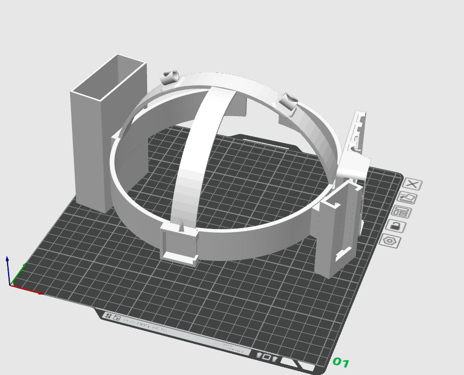

---

## 📐 Head Measurements & Base Geometry
- Head circumference: ~60 cm
- Side-to-side (sagittal width): 18 cm
- Front-to-back: 20 cm

### Elliptical Crown Design
- Used 3-point ellipse: center + front point + side point
- Dimensions chosen: **20 cm by 18 cm ellipse**
- The shell was then thickened and trimmed using `Split Body` and `Delete Face`

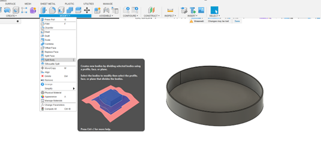 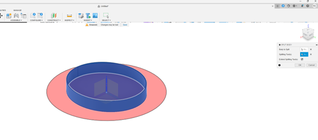

---

## 🧱 Structural Thickness & Printing Rules
- Layer thickness: **0.4 mm**
- Wall thickness: **2.0 mm** (for durability and clean slicing)
- Fillet radius: **0.5 mm** for all exposed edge rounds

> Important: Make all wall thicknesses a **multiple of nozzle size** to avoid print artifacts

---
## 🧠 Design Tricks & Challenges

### Deleting a Subsection
- Make a circle sketch over area
- Use **Extrude > Cut** mode to delete a portion cleanly

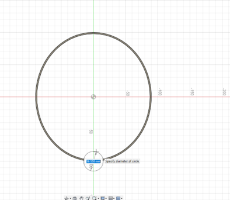

###  Arched Beams for Stability – Step-by-Step Construction

This section outlines the detailed steps for designing and attaching the overhead and front-facing arcs that stabilize the NaviGatr headset.

#### 🔄 Overview:
We used Fusion 360's `3-Point Arc` tool to construct two major arched beams:
- **Overhead arch**: Adds vertical stability from ear to ear
- **Forward beam**: Connects the top center to the front-mounted camera

#### ✍️ Step-by-Step Instructions:

**1. Create the Overhead Arc**
- Open a new sketch
- Select the plane **facing forward (frontal view)** of the head
- Use the `3-Point Arc` tool to:
  - Select left ear anchor point
  - Select right ear anchor point
  - Set third (top) point **~8 cm above** center for crown height

**2. Extrude the Arc**
- Finish the sketch
- Select the arc profile
- Use `Extrude` **both directions** symmetrically
- Create a flat rectangular surface along the arc

**3. Thicken the Arc into a Beam**
- Use the `Thicken` tool to give it structure (e.g., 2–3 mm thick)

**4. Add Forward Beam**
- Start a new sketch on a plane parallel to the sagittal midline
- Use another `3-Point Arc` to:
  - Connect the **top center of the headband**
  - To the **forward camera mount point**
- Extrude both ways, then thicken like above

**5. Press-Pull Fine Tuning**
- If arc ends don’t perfectly meet the headband:
  - Use the `Press Pull` tool
  - Hide other bodies for precision
  - Select the **small rectangular cross-sectional face at the end of the arc**
  - Pull or push the face until it intersects cleanly into the headband

**6. Final Cleanup**
- Use `Thicken` on the main headband base to hide or eliminate protruding geometry or weak gaps from the arc intersections

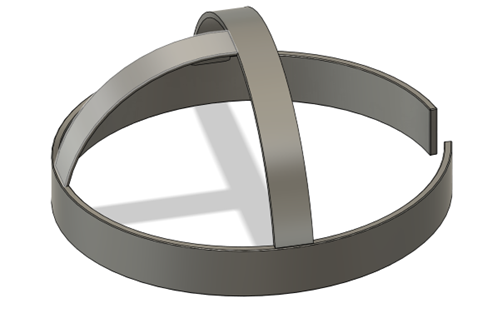

---

## 🧰 STL Import & Fusion Workflow
- Import STLs via `Insert > Mesh > STL`
- Convert mesh to body for editing
- To attach STLs to the base, create **rectangular standoffs** and **combine** with headband base
- Used `Press Pull` tool to merge intersecting components cleanly

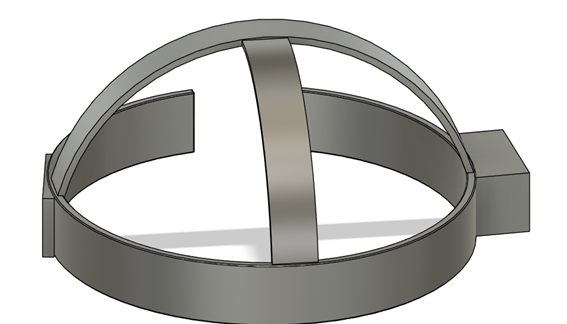

---

## 🔩 Mounting Holes & Screws
- Pi and Coral TPU: **M3 screws** (3mm)
- Pi Camera: **2.5mm screws**
- Created mounting holes and positioned standoffs accordingly

> Used M3 brass inserts for secure mounting of electronics

---

## 💨 Fan & Pi Mounting
- **Initial design** featured a Pi case with open-air fan mounts
- Used **2x 30mm fans** placed above the Pi board for better airflow
- Feedback noted that open fans could **catch hair**, so a redesign was implemented

### Redesign:
- Merged the fan-mount Pi case with a GPIO screen top
- GPIO screen housing sits **above the fans**, acting as a protective lid
- A hole was designed into the top cover to pass GPIO pins from the Pi to the screen

---

## 🧱 Component Mounting Overview – NaviGatr Headset
This document details the mounting strategy and design notes for each key hardware component in the NaviGatr headset. All modules were either custom-designed or adapted to fit the geometry and constraints of the 3D printed headband structure.

---

## 🔋 Power Bank

- **Type:** Anker 10,000 mAh USB-C power bank  
- **Weight:** ~250g  
- **Dimensions:** 110 x 66 x 26 mm

### Mount Design:
- Rectangular case designed to clamp securely onto the **rear arc** of the elliptical headband
- Clamps use flexible arms and shallow groove interface for grip
- Power cable is routed cleanly through designated slots to the Pi on the opposite side

> This rear placement balances the front-heavy mass of the Pi, screen, and fans, making the headset more ergonomic.

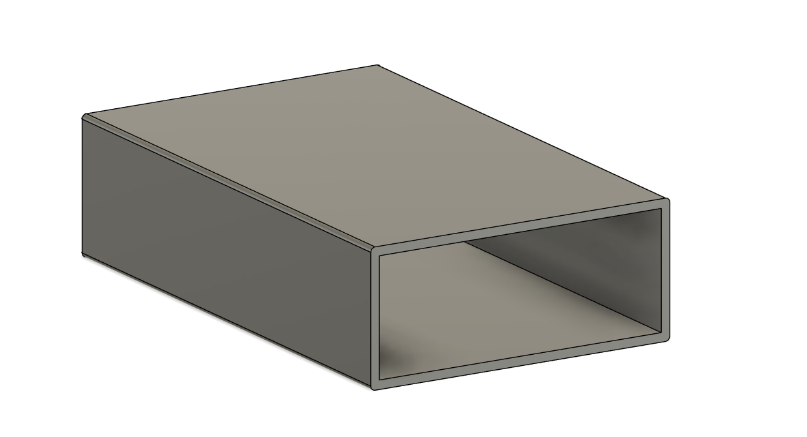

---

## 🧠 Raspberry Pi + GPIO Screen Module

### Structure:
- **Base:** Predesigned Raspberry Pi case
- **Top Cover:** Custom-designed to hold:
  - GPIO touchscreen display
  - Dual 30mm fans for active cooling

### Design Notes:
- The **top section** height was increased to accommodate the GPIO screen’s standoffs
- A cutout was added to route GPIO ribbon wires upward without bending
- **Lower half** had to be carefully planned so the **fans do not interfere** with GPIO pin access

> This hybrid case allowed full visibility and interaction with the screen, while preserving airflow and GPIO usability.

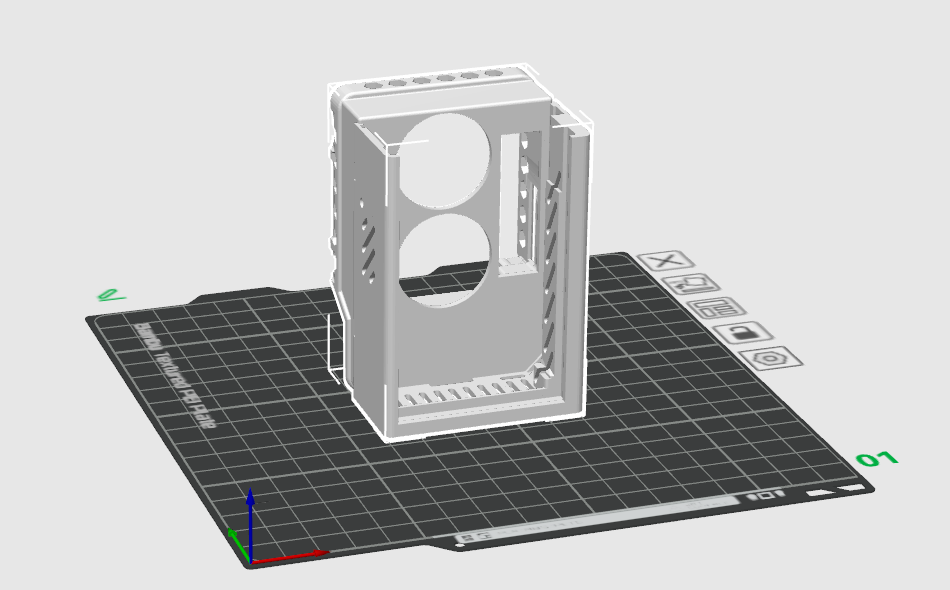

---

## 📷 Pi Camera
- Mounted on a forward-facing arc using a predesigned holder
- Positioned at eye-level for accurate vision tasks
- Ribbon cable routed through internal tracks to the Pi case in the rear

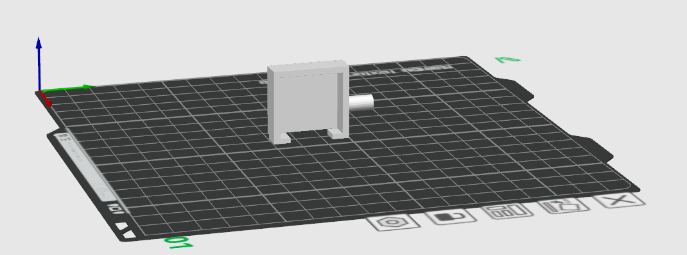

---

## 🧠 Coral TPU
- Housed in a predesigned TPU case
- Mounted near the side or base of the headband
- USB cable routed beneath the fans to minimize clutter

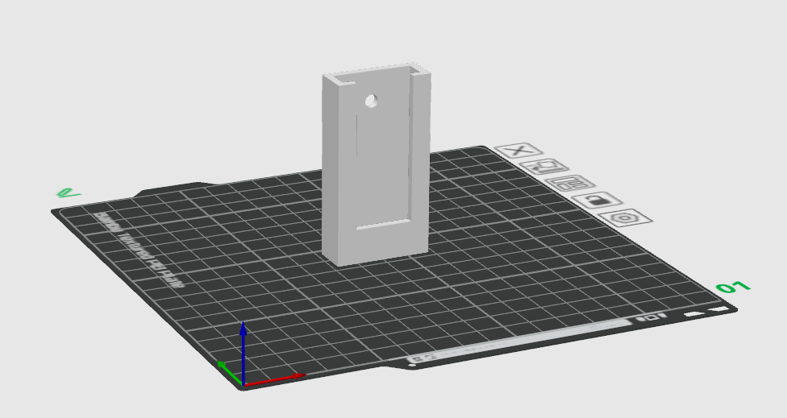

---

## 🧊 Fans (2x 30mm)
- Positioned directly above Raspberry Pi board
- Mounted beneath the GPIO screen
- Passive grills allow air intake while screen housing acts as protective lid

> Their placement ensures direct airflow to the Pi while minimizing dust and hair contact.

---

## 🪛 General Assembly Notes
- All modules are mounted via M3 screws or zip ties
- Openings and wire channels were integrated into the base model for clean cable management
- Components are modular and removable for maintenance

---

## ⚖️ Assembly Strategy
- The GPIO screen module fits onto the Pi case via standoffs
- Camera is mounted forward and routed through arch beam
- TPU and battery mount opposite each other for balance
- Fans face upward for passive convection through top mesh
- All components zip-tied or screw-secured to standoffs

---

### Print Troubleshooting
- A1 printer bed-slinging caused weak contact
- Switched to broader surface area for better adhesion
- Added brim/raft and slowed first-layer speeds

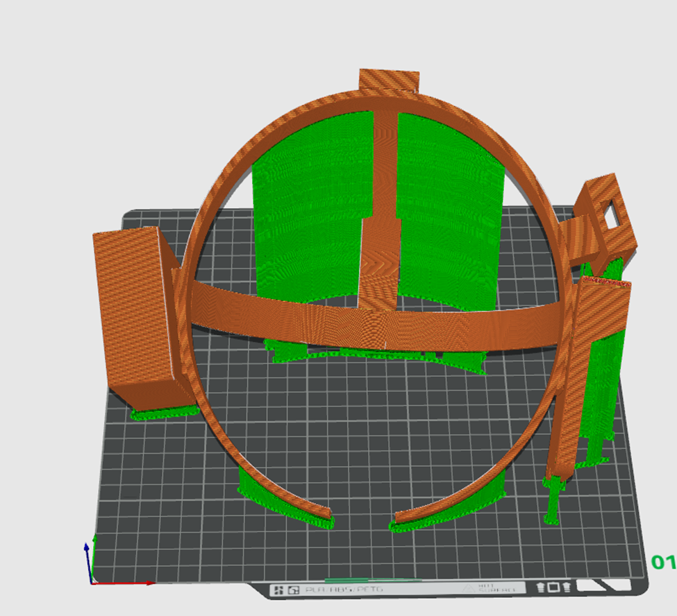 
- failed orientation

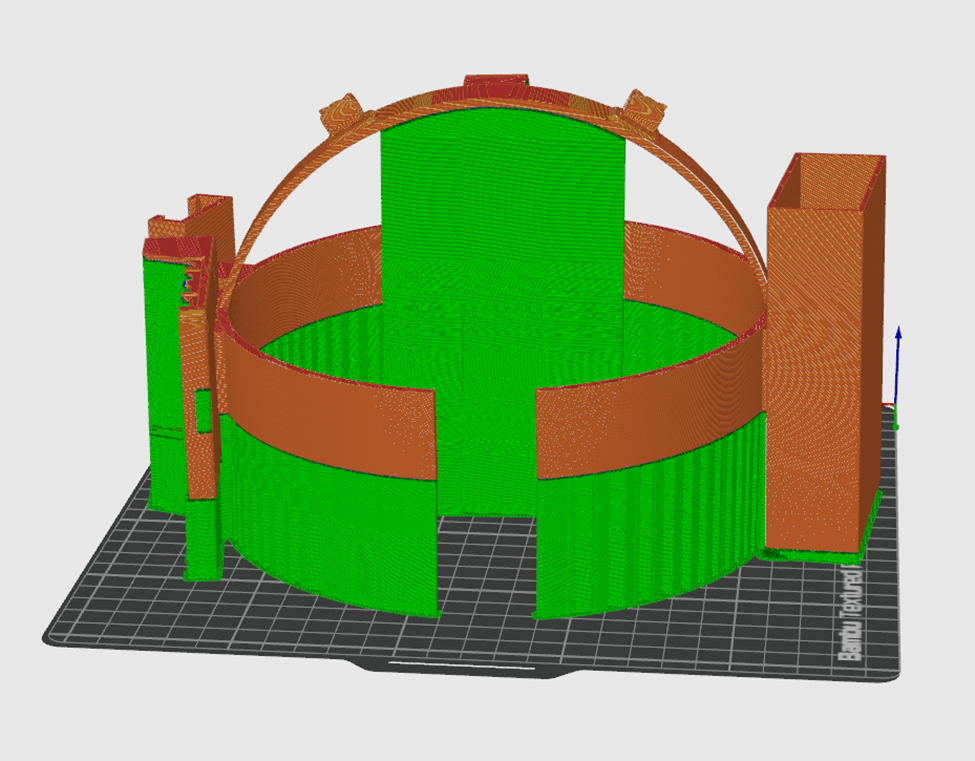
- more wasted material for supports but slinging adhesion

---

This custom 3D printed assembly forms the physical backbone of NaviGatr — balancing function, thermal safety, and wearable comfort.

