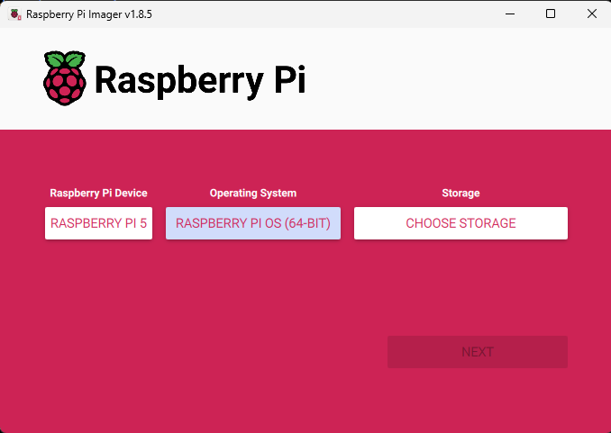
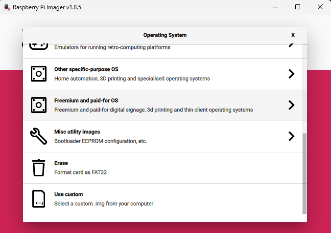

# Raspberry Pi 5 Setup for NaviGatr

This guide walks through setting up the Raspberry Pi 5 to run NaviGatr, focusing on installing the correct Python environment, dependencies, and getting the Coral TPU working with TensorFlow Lite and PyCoral.

---

## 🧰 Requirements

- Raspberry Pi 5 with microSD card
- Ubuntu 24.04 LTS Lite (64-bit)
- Internet access
- Optional: GPIO screen, fan, Coral USB TPU, Pi Camera

---

## 🚀 Step 1: Flash Ubuntu onto the Pi

1. Download [Raspberry Pi Imager](https://www.raspberrypi.com/software/)
2. Select OS: **Ubuntu 24.04 LTS (Lite, 64-bit)**
3. Select SD card and flash
4. Insert into Pi 5 and power on



---

## 🐍 Step 2: Install Python 3.9

Ubuntu comes with Python 3.11+, but the Coral TPU requires Python 3.9 to work properly with `tflite-runtime` and `pycoral`.

```bash
sudo apt update
sudo apt install software-properties-common -y
sudo add-apt-repository ppa:deadsnakes/ppa
sudo apt update
sudo apt install python3.9 python3.9-venv python3.9-dev -y
```

---

## 🛠 Step 3: Create Python 3.9 Virtual Environment

We use a virtual environment so we don’t interfere with the system Python (3.11+).

```bash
python3.9 -m venv navenv
source navenv/bin/activate
```

> Note: Do not use `sudo pip` or `sudo apt install` for Python packages inside the venv.

---

## 🧩 Step 4: Install TFLite and PyCoral (ARM64)

The Coral USB Accelerator only works with specific versions of `tflite-runtime` and `pycoral`. You **must download the .whl files manually**.

### 🔗 Downloads:

- [tflite\_runtime-2.5.0.post1-cp39-cp39-linux\_aarch64.whl](https://github.com/google-coral/pycoral/releases/download/release-frogfish/tflite_runtime-2.5.0.post1-cp39-cp39-linux_aarch64.whl)
- [pycoral-2.0.0-cp39-cp39-linux\_aarch64.whl](https://github.com/google-coral/pycoral/releases/tag/release-frogfish)

### 💾 Install:

```bash
pip install tflite_runtime-2.5.0.post1-cp39-cp39-linux_aarch64.whl
pip install pycoral-2.0.0-cp39-cp39-linux_aarch64.whl
```

> ❌ Do **not** use `sudo apt install` for `pycoral` or `tflite-runtime` — it will install them globally in Python 3.11 and break compatibility.

---

## 📦 Step 5: Install Remaining Dependencies

```bash
pip install numpy==1.26.4
pip install opencv-python==4.8.1.78
pip install Pillow==10.2.0
```

---

## 🖥️ Step 6: GPIO Screen Setup (LCD-show)

To use the GPIO 3.5" touchscreen display with Ubuntu, we use a modified version of the **LCD-show** utility.

### 📥 Clone LCD-show Repository:

```bash
git clone https://github.com/goodtft/LCD-show.git
cd LCD-show/
sudo chmod +x LCD35-show
```

### 🛠 Run the Installer Script:

```bash
sudo ./LCD35-show
```

This will:

- Copy required framebuffer drivers
- Modify boot config files
- Reboot your Pi

> 📌 Note: This script is primarily designed for Raspberry Pi OS. Some manual tweaks may be needed for Ubuntu compatibility (e.g., Xorg configuration or framebuffer rotation).

### 🧪 Test the Screen:

If the screen does not activate:

- Try modifying `/boot/firmware/config.txt` manually
- Ensure SPI and I2C interfaces are enabled
- Add:

```bash
hdmi_force_hotplug=1
dtoverlay=piscreen,speed=16000000,rotate=90
```
## ⚠️ Troubleshooting & Configuration Risks

### 🧨 Configuration File Errors

If you modify `/boot/firmware/config.txt` incorrectly, your Pi might not boot or function properly. For example, enabling conflicting buses or overlays can cause hardware-level issues.

> On small, inexpensive microprocessors like the Raspberry Pi, **there are no hardware safeties**. If you activate two incompatible GPIO buses, the board may not prevent it — you can **fry a capacitor or transistor** without warning.

This happened during our development with a Raspberry Pi 4. After misconfiguring `config.txt`, the Pi stopped functioning and had to be **fully replaced** with a Raspberry Pi 5.

### 🛠 Recovery with EEPROM Bootloader

If your Pi fails to boot due to bad configuration files:

1. Download [Raspberry Pi Imager](https://www.raspberrypi.com/software/)
2. Go to **Misc utility images** → **Raspberry Pi 4/5 EEPROM boot recovery**
3. Flash this image to a microSD card
4. Insert into the Pi and power on

This will reflash the Pi’s bootloader to factory defaults, similar to resetting a PC BIOS.

> This trick saved our project when `config.txt` errors rendered our Pi unbootable.


---

## ✅ Final Notes

- Always run NaviGatr code inside the virtual environment.
- To activate it in a new terminal:

```bash
source navenv/bin/activate
```

- If you use the GPIO screen, make sure it’s configured correctly and has access to the framebuffer.
- Test camera access via:

```bash
libcamera-still -o test.jpg
```

Once this setup is done, you’re ready to run the object detection and emotion recognition models on the Pi with Coral TPU acceleration.

