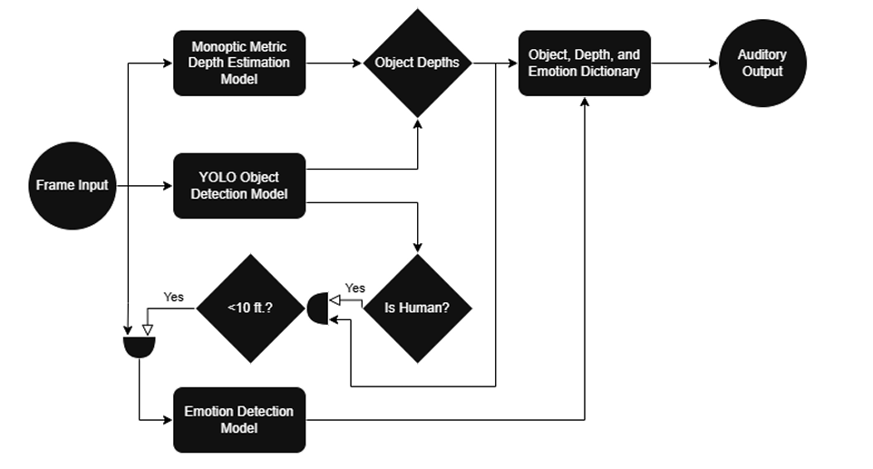
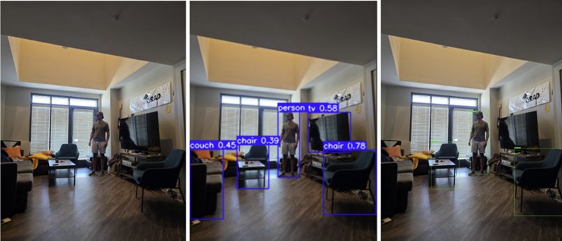
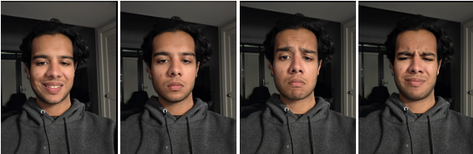
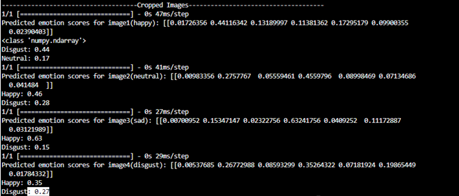
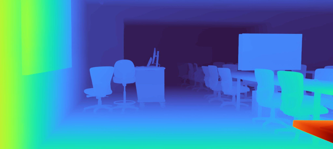
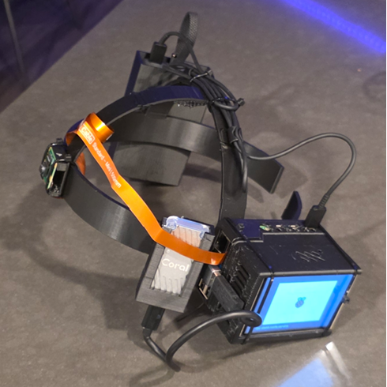

# NaviGatr: Wearable AI Navigation Assistant for the Visually Impaired

##  Introduction

**NaviGatr** is a project that aims to aid the visually impaired using various computer vision algorithms. While prior systems have used object detection or depth sensing independently, a **combined real-time approach** has not been widely implemented.

Our system uses **three different machine learning models** to extract spatial and contextual data from camera frames captured at **eye level** via a wearable headset. These models perform:

- **Object detection**
- **Monocular depth estimation**
- **Emotion recognition**

The output of these models is aggregated, interpreted, and passed to an output module — currently implemented as a **voice assistant** — which guides the user with auditory cues about their surroundings.

---

## 🔦 Computer Vision Models

### 🔍 Object Detection
We use different object detection models based on platform constraints:

- On **Windows** and higher-powered PCs, we run **YOLOv11n** (from Ultralytics), which offers fast and accurate detection across 80 COCO classes.
- On the **Raspberry Pi 5 with Coral TPU**, we use **SSD MobileNet V2**, a lightweight model optimized for edge inference.

Both models return bounding boxes and class labels which are combined with depth data to localize and describe objects to the user in real-world terms.

### 😐 Emotion Detection
We trained a custom model based on the **FER2013 dataset**, using the **EfficientNetB0** architecture. This model runs on the Coral TPU and:
- Accepts cropped 256x256 RGB facial images
- Classifies emotions such as happy, sad, angry, disgust, etc.
- Triggers only when a person is nearby (~10 feet)

This allows NaviGatr to add **social context** to the user’s environment.

### 📏 Depth Sensing
We use Apple’s **Depth Pro** model — a monocular depth estimation model that returns **absolute metric depth**, unlike most models that return relative depth.

- Deployed on a **GPU cloud instance** (AWS EC2)
- Receives images from the Pi over HTTPS
- Returns a dense depth map and focal length for use in positioning

Depth Pro uses a transformer-based architecture and produces sharp gradients and accurate boundaries. The results are used to locate how far away each object is in meters.

## 🔊 Output Handling

This is how we handled output delivery in NaviGatr:

The **object detection model** returns an array of bounding boxes, each containing (x, y) coordinates relative to the camera image. Meanwhile, the **depth estimation model** outputs a dense depth map containing the estimated distance (in meters) for each pixel.

### 🧮 Determining Object Depth:
- For each object’s bounding box, we isolate the corresponding sub-array in the depth map.
- We select the **minimum value** within this sub-array to approximate the object’s nearest point.
- This gives us a real-world distance to each object.

### 🕒 Spatial Orientation:
- We divide the image horizontally into **four quadrants** to mimic a **clock-based directional guide**.
- Depending on the x-coordinate of the bounding box center, we label objects using clock directions like:
  - 10 o’clock, 11 o’clock, 12 o’clock, 1 o’clock, 2 o’clock
- This makes the system more intuitive for the user.

Example: If a chair is detected with its bounding box centered near the left-middle of the image and its depth is 2 meters, the audio output will be:
> **"Chair, 11 o'clock, 2 meters away"**

### 🙂 Emotion Awareness:
- If the detected object is a **person**, their cropped bounding box is passed to the **emotion detection model**.
- The model returns the emotional state, which is appended to the output.

Example: If a sad person is detected at the right side:
> **"Person, 1 o'clock, sad"**

The output is then synthesized into speech and delivered via audio for real-time navigation assistance.

---

---

## 🛠️ Hardware Overview

### Raspberry Pi 5
- 8GB RAM
- Quad-core Cortex-A76 CPU (64-bit)
- Runs **Ubuntu 24.04 LTS (Lite)** for edge performance and compatibility

### Pi Camera
- Mounted front-facing at eye level
- Captures real-time frames at 30 FPS
- Connected via a long ribbon cable

### Coral TPU
- USB accelerator for running **TFLite quantized models**
- Enables real-time inference for object and emotion detection

### GPIO Display
- 3.5" touchscreen for demonstration and debugging
- Displays bounding boxes, logs, and FPS rates

### Power Bank
- 10,000 mAh Anker bank with USB-C output
- Powers the Pi, TPU, fans, and display

### 3D Printed Headband
- Custom CAD design with:
  - TPU holder
  - Battery holster
  - Pi + Fan housing
  - Balanced, ergonomic fit
- Printed using **PLA** with rounded edges for safety
- Fans positioned for thermal regulation

---

## 🔗 Further Docs & Resources

### 📂 [Raspberry Pi 5 Setup & Firmware](./docs/setup.md)
Full walkthrough for flashing Ubuntu, installing dependencies, setting up camera access, and running the core script.

### ⚡ [Wiring & Power Guide](./docs/wiring.md)
Wiring diagrams for GPIO display, fans, Coral TPU, and safe USB-C routing.

### 📽️ [3D Design & Hardware Assembly](./docs/3d-printing.md)
STL files, CAD renderings, and assembly instructions for the NaviGatr headset.

### 📄 [Final Report (PDF)](./Final_Report.pdf)
Complete engineering report including benchmarking, design decisions, and testing plans.

### 📚 [GitHub Repository](https://github.com/naitikg2305/NaviGatr)
Codebase for the models, hardware integration, and deployment scripts.

### 🎥 [Demonstration Video](https://example.com/demo)
(Coming soon) Live test run of NaviGatr navigating a test environment.

---

## 👥 Team Members
- **Naitik Gupta** — Emotion detection, Pi integration, hardware design, overall integration
- **Micah Wright** — Object detection, documentation, camera logic
- **Eliav Hamburger** — Depth estimation, cloud backend, testing and validation

---

**NaviGatr** pushes the boundary of accessible computing, demonstrating how on-device machine learning and thoughtful hardware design can empower a community often overlooked by mainstream tech.

