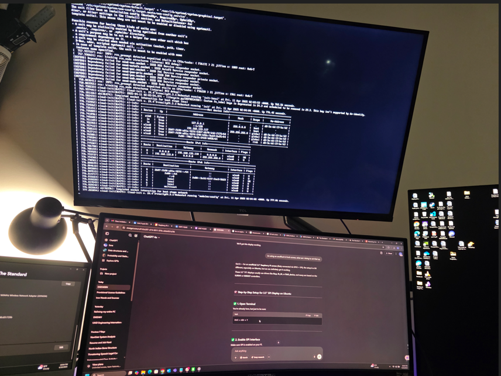

# Useful Linux Commands for Coral TPU & Python Projects

This markdown file compiles various Linux commands, tools, and package management concepts used throughout our Coral TPU setup and Python project deployment on Raspberry Pi. These are essential for embedded system and AI/ML development workflows.


---

## 🔧 System & Package Setup

### 🐍 Virtual Environment (Python 3.9)
```bash
sudo apt install python3.9 python3.9-venv python3.9-dev -y
python3.9 -m venv coral_env
source coral_env/bin/activate
```

### 📦 Installing Packages

#### `apt-get` (System-wide packages)
```bash
sudo apt-get update
sudo apt-get install <package-name>
```
Example:
```bash
sudo apt-get install python3-pip python3-opencv
```

#### `pip` (Python packages — inside venv)
```bash
pip install <package>
```
Example:
```bash
pip install numpy==1.26.4 opencv-python pycoral tflite-runtime==2.5.0.post1
```

#### `wget` (Download files)
```bash
wget <url>
```
Example:
```bash
wget https://github.com/google-coral/pycoral/releases/download/v2.0.0/tflite_runtime-2.5.0.post1-cp39-cp39-linux_aarch64.whl
```

---

## ❌ Uninstalling

### `apt` Packages
```bash
sudo apt remove <package-name>
```

### `pip` Packages
```bash
pip uninstall <package-name>
```
Run multiple times if needed (e.g., if a package exists in multiple locations).

---

## 🐚 Shell Commands for Debugging & Navigation

### File Inspection
```bash
ls -l              # List with permissions
cd <dir>           # Change directory
pwd                # Current working directory
cat <file>         # Print contents
head <file>        # First 10 lines
```

### Grep & Piping
```bash
grep 'search' <file>              # Search in file
dmesg | grep usb                  # Filter kernel logs
ls -la | grep py                 # Show Python files in current dir
```

### Redirect & Pipe
```bash
command > file.txt               # Redirect stdout to file
command >> file.txt              # Append stdout
command1 | command2              # Pipe output of command1 to command2
```

---

## 🧠 Understanding Tools

| Tool          | Scope               | Usage                                |
|---------------|----------------------|----------------------------------------|
| `apt-get`     | System-wide          | Install C/C++ libs, Python runtime     |
| `pip`         | Python package mgr   | Python libraries                       |
| `venv`        | Isolated Python env  | Avoids global dependency conflicts     |
| `sudo`        | Admin privileges     | Required for system-wide changes       |
| `wget`        | CLI downloader       | Fetch `.whl`, `.deb`, `.zip`, etc.     |
| `python3.X`   | Version selector     | Use desired Python interpreter         |

---

## 🧼 Cleaning Up
```bash
sudo apt autoremove             # Removes unused packages
deactivate                      # Exit virtualenv
rm -rf coral_env                # Delete environment folder
```

---

## ✅ Tips for Developers
- Always check which `python` or `pip` is being used:
  ```bash
  which python
  which pip
  ```
- Use `grep` and `find` to locate files:
  ```bash
  find . -name "*.py" | grep main
  ```
- Use `chmod +x script.sh` to make a shell script executable.

---

Let me know if you want to add: git commands, Docker basics, or build tooling (e.g., Make, cmake, etc).

