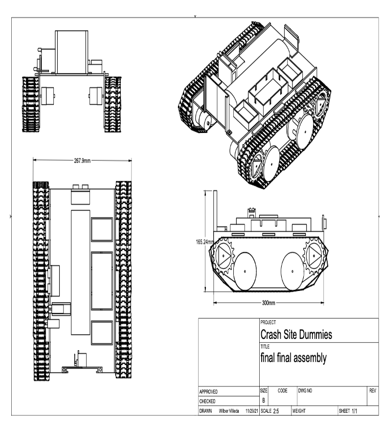
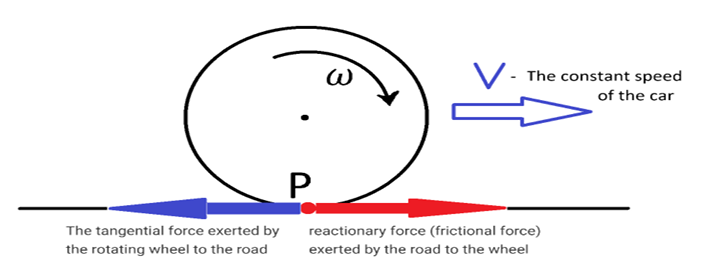
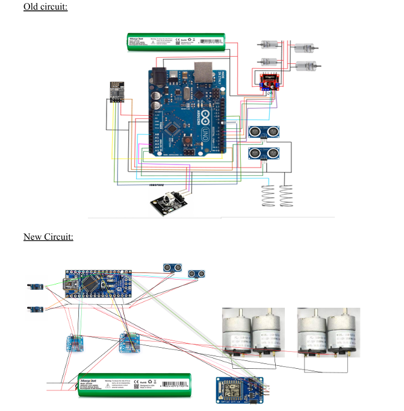
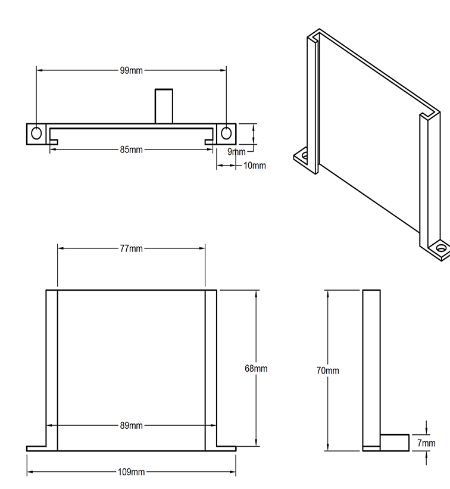

# Autonomous Rover: Crash Site Dummies  
**Course**: ENES100 – Introduction to Engineering Design  
**Team**: Crash Site Dummies  
**Semester**: Fall 2021  

## 🧭 Project Overview  
Our team designed and built an Over-Terrain Vehicle (OTV) for autonomous crash site assessment. The mission required the OTV to:  
- Navigate to a crash site within 150 mm accuracy  
- Detect and measure an abnormality (black vs. metallic surface)  
- Drop an ArUco marker accurately within 20° of the anomaly  
- Continue through an obstacle course into a destination zone  

> 🧠 The core propulsion system — a **tank tread drive with 4 motors** — was conceptualized and led by **Naitik Gupta**, who pushed for maximum ground contact and climbing ability from the start. This idea shaped the entire form factor and mission execution strategy of the rover.

---

## 🛠️ Final System Breakdown

### 🚗 Modeling (Giovanni Ratti)
- **Measured Speed**: 20 ft in 7.2 s → 0.85 m/s  
- **Angular velocity**: ~338 RPM (very close to the motor's no-load spec of 350 RPM)  
- **Estimated Stall Torque**: ~1 N·m  
- **Predicted Required Torque**: ~0.02 N·m  
➡️ Motors were significantly overpowered, ensuring consistent propulsion under all terrain conditions.

### 🔌 Electronics (Naitik Gupta)
- Switched from **Arduino Uno to Nano** for space savings.
- Introduced **hot-swappable Nano sockets** after burning out the first board. We soldered female headers to allow quick Nano replacement — this saved us from catastrophic setbacks late in development.
- **Replaced early metal prong concept** with more reliable IR sensors.
- Added a second **H-Bridge** to balance load across channels and prevent overheating.

### 🧱 Engineering & CAD (Wilber Villeda)
- Final chassis design included:
  - Dual H-Bridges  
  - IR sensor mount (custom 3D printed)  
  - ArUco marker dropper  
  - Servo motor  
  - Relocated battery compartment  
- Custom mounting points and 3D-printed holders allowed rapid sensor swaps and wiring adjustments.

### 🔄 Prototyping (Justin Nguyen)
- Conceptual iteration:
  - Camera-based approach scrapped due to Arduino limitations.  
  - Metal prongs were tested and discarded for safety reasons.  
  - Final setup: IR + ultrasonic combo — accurate, Arduino-compatible, and fast.
- Prototyping process emphasized **practical solutions over theoretical elegance**.

### 🐞 Troubleshooting (Christina Zhang & Naitik Gupta)
- Debugged upload failures and inconsistent performance caused by conflicts on digital pins 0 & 1 of the Nano.
- Diagnosed driver compatibility issues requiring alternate CH340 drivers.
- Adopted a **fail-safe wiring standard** after identifying sensitive voltage pins and upload behaviors.

### 🤝 Teamwork (Sammy Hung)
- Project shifted from centralized decision-making to **sub-team autonomy**, which greatly improved efficiency.
- Peer-reviewed contributions ensured quality without bottlenecks.
- Example: ArUco dropper CAD was finalized by a single member, approved by the team, and printed quickly.

---

## 🎯 Outcome Summary
- ✅ Successfully detected the anomaly and deployed the marker  
- ❌ Did not complete obstacle navigation or reach final zone due to limited time  
- 🛠 The project emphasized functionality, iteration, and solving real engineering problems under constraint  

---

## 📐 Technical Specifications
- **Drive System**: 4x motor tank tread (original idea by Naitik Gupta)  
- **Max Speed**: 0.85 m/s  
- **Angular Velocity**: ~338 RPM  
- **Motors**: High-RPM DC motors  
- **Sensors**: 2x Ultrasonic, 1x IR  
- **Microcontroller**: Arduino Nano (hot-swappable)  
- **Power System**: Dual H-Bridge motor drivers  
- **Chassis**: Custom CAD-built from laser-cut wood and 3D-printed mounts  
- **Marker System**: Servo-actuated ArUco tag dropper  

---

## 🔗 Media & Artifacts
- [Troubleshooting Video](https://drive.google.com/file/d/1S_xejck7EEdAvqfXrduQV0JODKotn2uJ/view?usp=sharing)  
- CAD drawings and schematics available on request  

---

## 🧠 Lessons Learned
- Simpler systems (IR vs. vision) perform better on embedded hardware like Arduino.
- Design with **hot-swappability** in mind — it saved our project when hardware failed.
- Sub-teams allow parallel workstreams and faster iteration cycles.
- Arduino’s digital pins 0 & 1 should be avoided during code upload stages.

---
