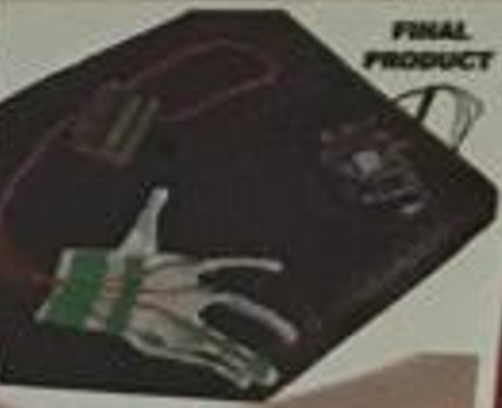
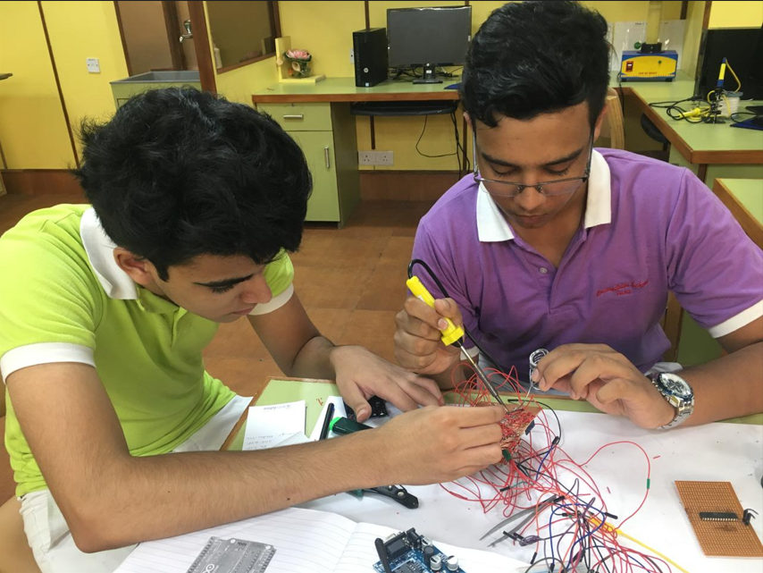

# 🩺 Smart Assistive Device for Paralytic Patients
## team: Naitik Gupta, Anushree Jain, Kaartik Issar, Dr. Lele(Guidance)

## 💡 Overview

This project was designed to assist **paralytic patients** in both **communicating their needs** and **ensuring safety through fall detection**. It consists of two main subsystems:

1. **Glove-Based Communication Interface**
2. **Fall Detection Belt System**

By combining sensor-based gesture recognition with motion sensing and real-time communication modules, the system empowers patients to signal caretakers and automatically alert them in case of falls.

---

## ✋ Part 1: Glove-Based Communication System

A **custom-built wearable glove** allows patients with limited mobility to flex their fingers and trigger pre-programmed commands that convey their needs.

### 🔧 Components:
- **Flex Sensors** – Attached to each finger to measure bending.
- **Arduino Microcontroller** – Central controller that reads sensor data.
- **Bluetooth / Wi-Fi / GSM Modules** – For transmitting messages to caretakers.

### 🧠 Functionality:
- Finger gestures are mapped to specific commands like:
  - 💧 Requesting water
  - 🍽️ Indicating hunger
  - 🚽 Needing to use the bathroom
  - 📺 Watching or changing TV
- These gestures are interpreted by the Arduino and sent as messages wirelessly to connected caretakers or smart displays.

---

## 🛡️ Part 2: Fall Detection Belt

A **wearable belt system** was developed to detect falls using motion analysis.

### 🔧 Components:
- **Accelerometer (e.g., MPU6050)** – Detects sudden drops or changes in acceleration.
- **Gyroscope** – Measures angular motion to differentiate between a fall and regular movement.
- **Arduino** – Processes sensor data in real-time.
- **Communication Modules**:
  - **Wi-Fi**
  - **Bluetooth**
  - **GSM (SIM800)** – For cellular alerts

### 🧪 Testing Method:
- The device was mounted on a test rig (e.g., a box) and dropped to simulate a fall.
- Observed sharp changes in acceleration (e.g., from ~1g to 0g) and angular displacement were used to trigger fall events.

---

## 📡 Communication Stack

The entire system supports **multi-mode communication** to ensure alerts are reliably delivered:
- **Bluetooth** – Short-range personal alerting
- **Wi-Fi** – Home or hospital network alerts
- **GSM/SMS** – Long-range alerts via cellular network

---

## 📌 Summary

| Feature | Description |
|--------|-------------|
| Communication | Glove gestures via flex sensors |
| Safety | Automatic fall detection from motion sensors |
| Microcontroller | Arduino (acts as the brain for both systems) |
| Sensors | Flex sensors, accelerometer, gyroscope |
| Connectivity | Wi-Fi, Bluetooth, GSM modules |

---

## 🚀 Future Improvements
- Machine learning model to adapt to personal gesture patterns
- Integration with smart home systems or hospital dashboards
- Rechargeable battery design with power optimization
- Miniaturized wearable form factor

