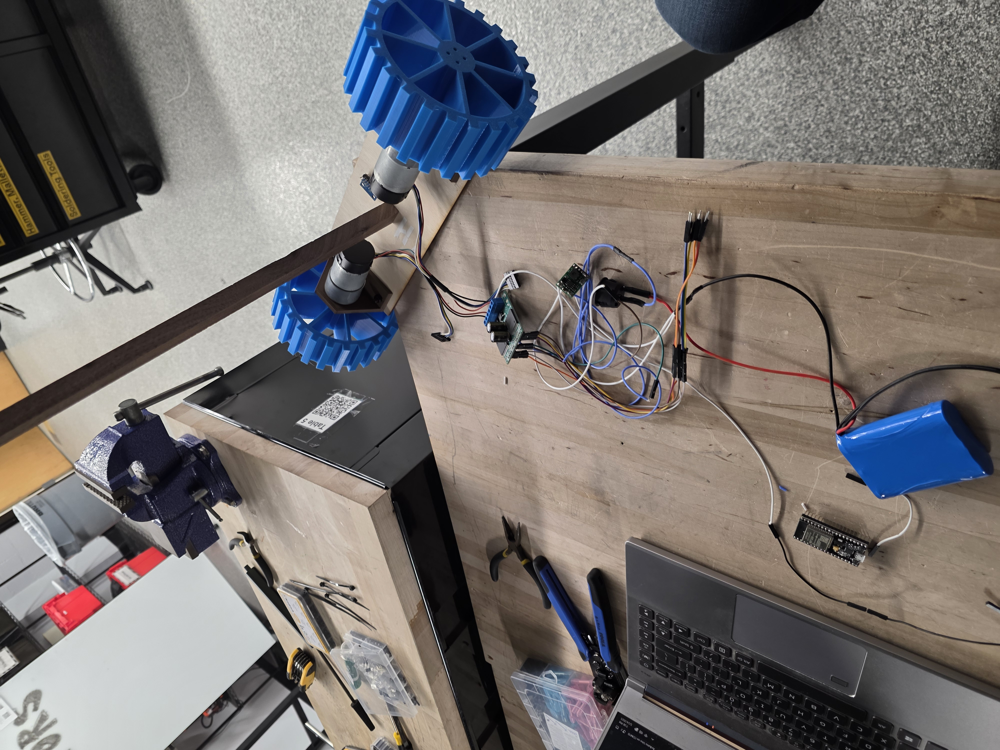
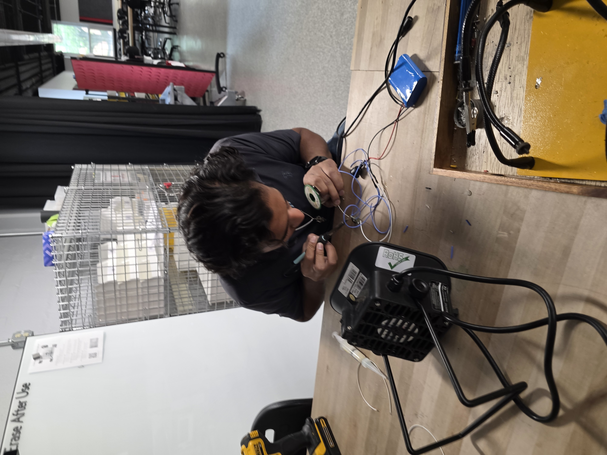

# Self-Balancing Robot

Welcome to the official project page for our Self-Balancing Robot. This website showcases the development, implementation, and final results of our autonomous two-wheeled balancing robot. Built as part of our control systems course (ENEE/ENME 461), this project merges hardware, software, and control theory into a compact, responsive platform.

---

## 🚀 Introduction

Inspired by the classic inverted pendulum problem, our robot demonstrates real-time balance using sensor feedback and PID control. It uses an ESP32 microcontroller, an MPU6050 IMU, and two DC gear motors controlled via a dual H-bridge. The challenge? Keep the robot upright on just two wheels—like a miniature Segway.

---

## 🛠️ Hardware Design

Our robot features:

- **Microcontroller:** ESP32 (DevKit v1)
- **Sensor:** MPU6050 (6-DOF IMU)
- **Motors:** 2x Pololu 3701 6V DC gear motors
- **Motor Driver:** L298N Dual H-Bridge
- **Power:** 12V Li-ion battery, 2x buck converters for 5V/3.3V
- **Frame:** 3D-printed chassis, with electronics mounted low for stability
- **Extras:** Darth Vader figurine on top for aesthetics!

> **Wiring Note:** We routed power from the 12V battery through buck converters to deliver clean 5V and 3.3V for logic and sensor components. All grounds from the Arduino, H-bridge, IMU, and buck converters are tied together to form a common ground reference. Motor power lines run directly from the battery to the L298N to handle current draw, while logic control pins are connected from the Arduino to the H-bridge via digital pins. I²C lines from the MPU6050 are connected to A4 and A5, with pull-up resistors handled internally. Each connection was tested using a multimeter for continuity, and critical joints were soldered and insulated with shrink wrap for durability.

All components were selected based on torque calculations and center of mass optimization. The wheels are 5 inches in diameter, offering a balance between responsiveness and ground clearance.

> The IMU is mounted close to the motors to reduce sensor lag and noise, while the battery is positioned low in the chassis to help with overall center of mass and balancing. The buck converters provide stable 5V and 3.3V rails from the main 12V battery, which also directly powers the motors and is safe for the Arduino’s VIN input (which tolerates up to 12V). Even with a 2V drop across the motors, our logic power is regulated and isolated from load variations.

### 🧵 Wiring Details

We routed power from the 12V battery through buck converters to deliver clean 5V and 3.3V for logic and sensor components. All grounds from the Arduino, H-bridge, IMU, and buck converters are tied together to form a common ground reference. Motor power lines run directly from the battery to the L298N to handle current draw, while logic control pins are connected from the Arduino to the H-bridge via digital pins. I²C lines from the MPU6050 are connected to A4 and A5, with pull-up resistors handled internally. Each connection was tested using a multimeter for continuity, and critical joints were soldered and insulated with shrink wrap for durability.

---

---

## 📐 CAD and Mechanical Assembly

The chassis was designed using Fusion360 and printed with PLA. The base houses the motors, driver, and battery. A custom bracket mounts the IMU at wheel axle level to reduce measurement noise. Zip ties and shrink tubing were used to secure and organize wires.

 

---

## 🧠 Control System

We implemented a PD (Proportional-Derivative) control loop in C++ on the ESP32. Real-time pitch angle is read from the MPU6050, processed, and used to drive the motors with appropriate speed and direction. The system runs a loop every few milliseconds and includes a safety cutoff if the robot tilts beyond ±25°.

Key features:
- MPU6050 offset calibration at boot
- PWM-based motor control
- Dead zone for motor inputs below threshold
- Safety limits for excessive tilt

---

## 🧪 Testing and Tuning

Initial tuning was done using only the proportional term (Kp). We observed oscillations and instability at high Kp values. Adding the derivative term (Kd) improved stability and response time.

Final stable tuning:
- Kp: 3
- Kd: 300–450 (varies by configuration)

We used MS Excel’s Data Streamer to collect and visualize data from serial output, allowing analysis of angle, error, and motor input over time.

---

## 📹 Demo and Results

Our robot successfully balances under mild disturbances and showcases dynamic feedback in action. It reacts quickly, stabilizes after nudges, and remains upright unless excessive weight or tilt is applied.

---

## 🔧 Full Parts List

Refer to the shopping list document for exact components. Major items include:
- ESP32 DevKit
- MPU6050 IMU
- L298N Motor Driver
- 2x DC Gear Motors
- 12V Li-ion Battery
- 2x Buck Converters
- Custom 3D Printed Frame
- Darth Vader Figurine 😎

---
## 🔌 Wiring Table

| Function        | Component       | Arduino Pin | Direction     | Notes                            |
|----------------|-----------------|-------------|---------------|----------------------------------|
| Motor A DIR 1  | H-Bridge INA1   | D7          | Output        | Sets forward/reverse             |
| Motor A DIR 2  | H-Bridge INB1   | D8          | Output        |                                  |
| Motor A PWM    | H-Bridge PWM1  | D5          | PWM Output    |                                  |
| Motor B DIR 1  | H-Bridge INA2   | D9          | Output        |                                  |
| Motor B DIR 2  | H-Bridge INB2   | D10         | Output        |                                  |
| Motor B PWM    | H-Bridge PWM2  | D6          | PWM Output    |                                  |
| I²C SDA        | MPU6050         | A4          | I²C           | Connects to MPU6050 SDA          |
| I²C SCL        | MPU6050         | A5          | I²C           | Connects to MPU6050 SCL          |
| 5V Logic Power | H-Bridge / IMU  | -           | Power         | From 5V buck converter           |
| GND            | All Devices     | -           | Ground        | Common ground for all            |
| VIN            | 9V Battery      | VIN         | Power Input   | Powers Arduino Uno               |

---

## 📅 Timeline

**Week 1:**
- Finalize CAD and ESP32 code
- Test IMU communication
- Set up buck converters

**Week 2:**
- Assemble robot frame
- Integrate electronics
- Start PID integration

**Week 3:**
- Tune PID controller
- Perform final testing
- Record demo and finalize documentation

---

## 🎓 Conclusion

This project was a successful application of control theory, hardware integration, and real-time feedback systems. Despite minor hardware limitations (motor torque, wheel grip), we achieved a reliable self-balancing robot that visually and functionally reflects our knowledge in embedded control.

---

## 📁 Appendix

- [Final Report (PDF)](link-to-pdf)
- [Shopping List (PDF)](link-to-shopping-list)
- [Proposal and Technical Details](link-to-proposal)
- [Demo Videos](https://drive.google.com/drive/folders/1PLejTndw4LxtoSVA8v18seIj9uFeChZ4?usp=sharing)

---
